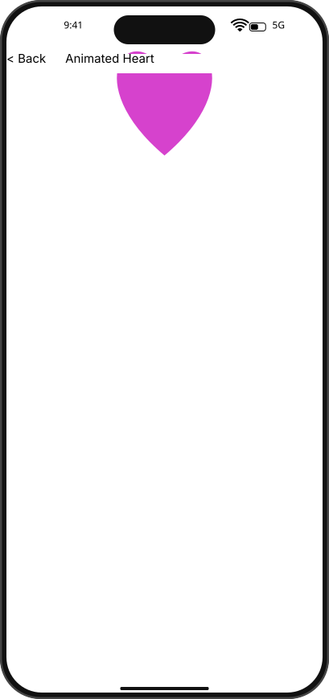

# Integration Test Run

## Timeline

# TestApp

Open the test app to see the menu with SDK examples.

## Scenario

Verify that heart animation keeps ticking after pointer hover on Back.

### 01. Home

### 02. Heart.Rest

### 03. Heart.PrimaryPeak

### 04. MouseOverBack

### 05. Heart.Rest.AfterMouseOver

- Heart.Rest vs Heart.PrimaryPeak should differ before hover.
- Heart.Rest.AfterMouseOver vs Heart.PrimaryPeak.AfterMouseOver should also differ.

### 06. Heart.PrimaryPeak.AfterMouseOver

