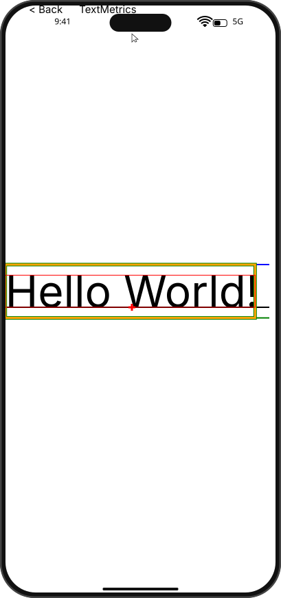
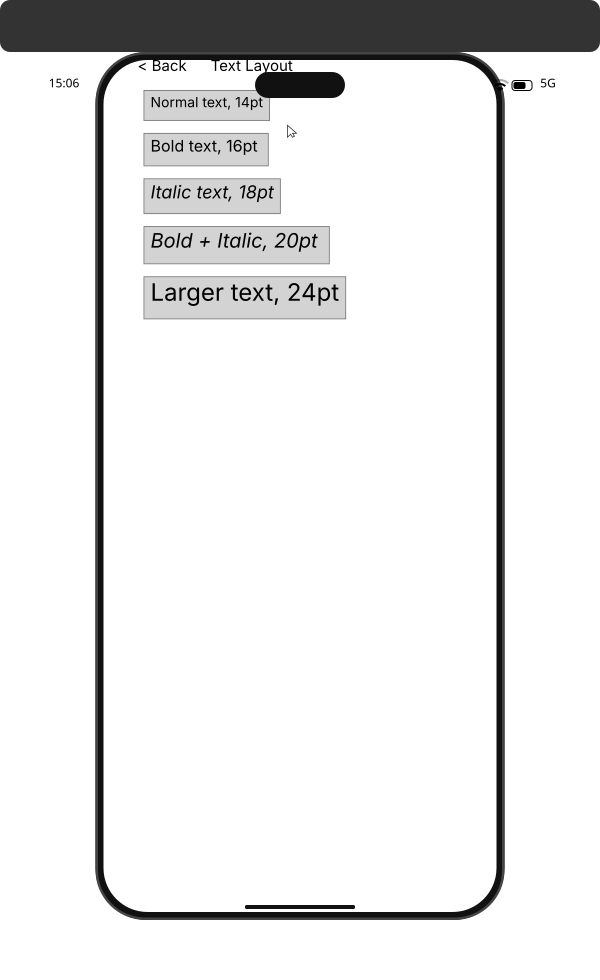
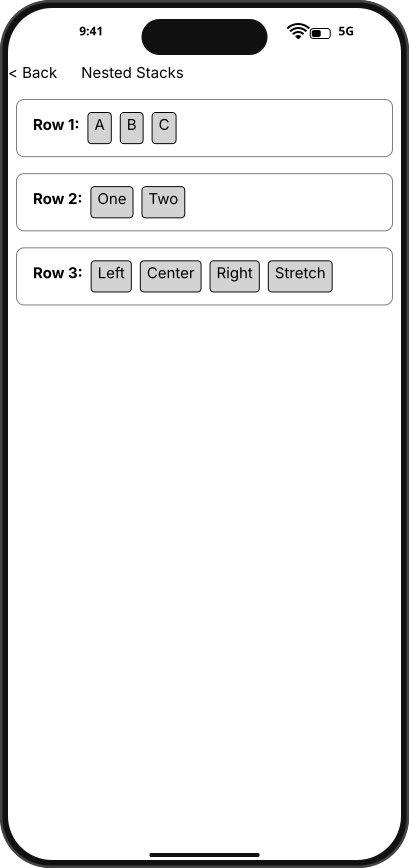
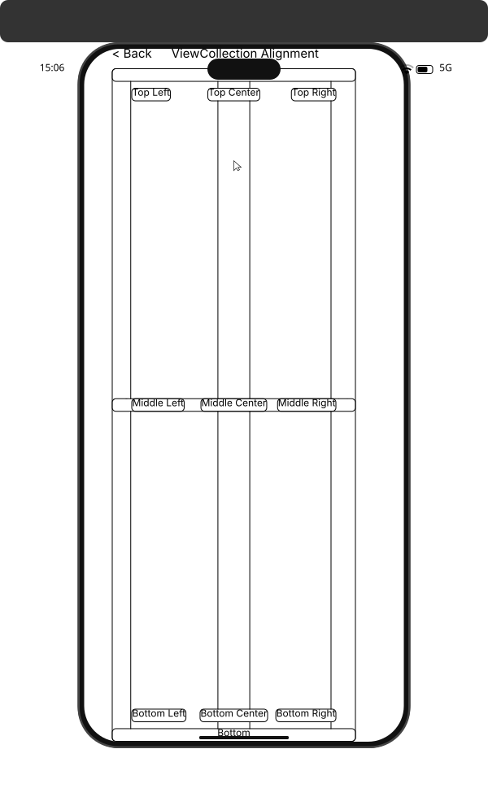
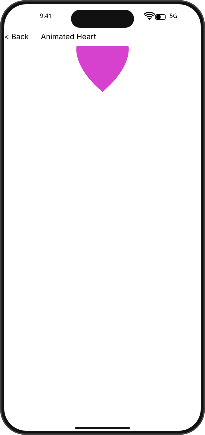

# Integration Test Run

## Timeline

# TestApp

Open the test app to see the menu with SDK examples.

## Scenario

Visit each example page from home, snapshot it, then return to home.

### 01. HomePage

### Navigate: TextMetrics

### 02. TextMetrics

### Navigate: TextLayout

### 03. TextLayout

### Navigate: NestedStacks

### 04. NestedStacks

### Navigate: ViewCollectionAlignment

### 05. ViewCollectionAlignment

### Navigate: AnimatedHeart

### 06. AnimatedHeart

### Navigate: TextBox

### 07. TextBox

