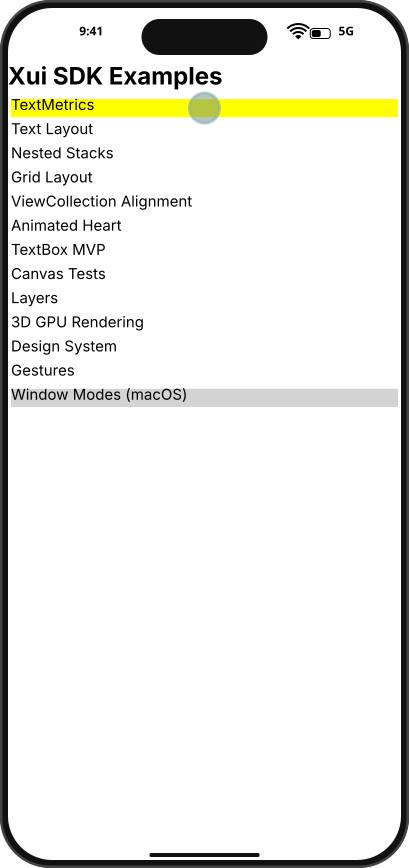

# Integration Test Run

## Timeline

# TestApp

Open the test app to see the menu with SDK examples.

## Scenario

Navigate from home to the TextMetrics example and capture hover/press transitions.

### 01. HomePage

- Hover TextMetrics button
- Press TextMetrics button
- Release to navigate

### 02. Hover

### 03. Pressed

### 04. TextMetrics

