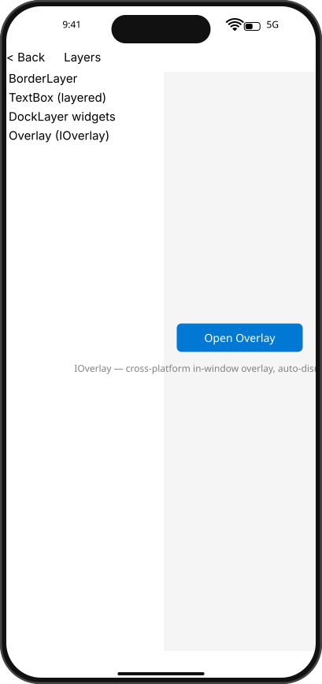

# Integration Test Run

## Timeline

# TestApp

Open the test app to see the menu with SDK examples.

## Scenario

Open the Layers overlay demo, display overlay popup, and dismiss by outside click.

```
Interaction points:
- Open Overlay button: (500, 262)
- Outside click dismiss point: (220, 40)
```

### 01. Layers.OverlayDemo


### 02. Layers.OverlayOpen



### 03. Layers.OverlayDismissed


