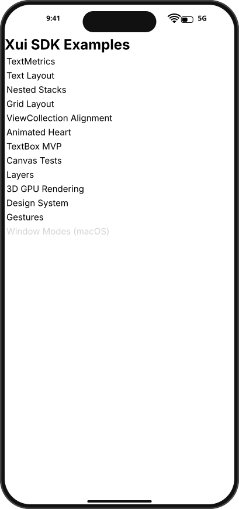
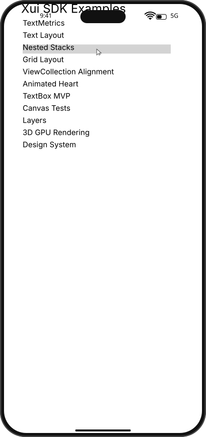
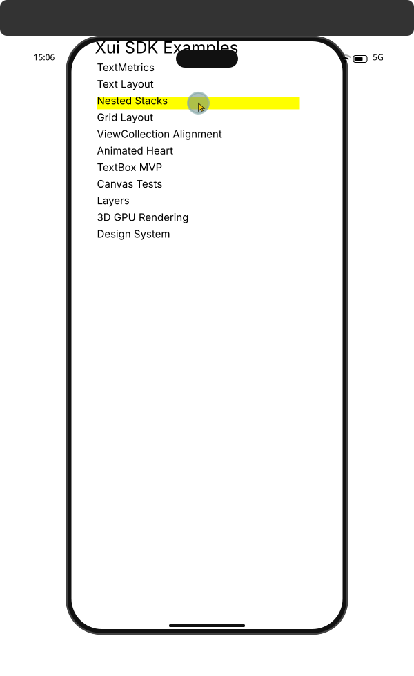
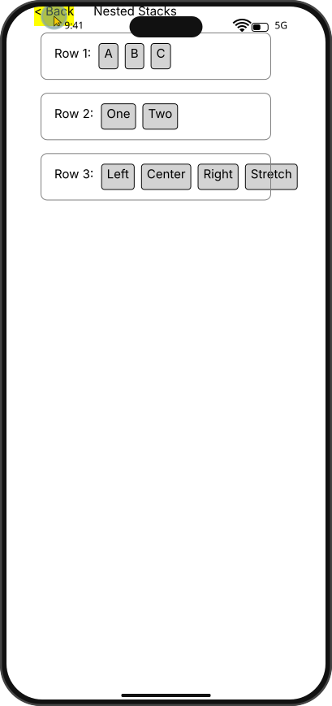
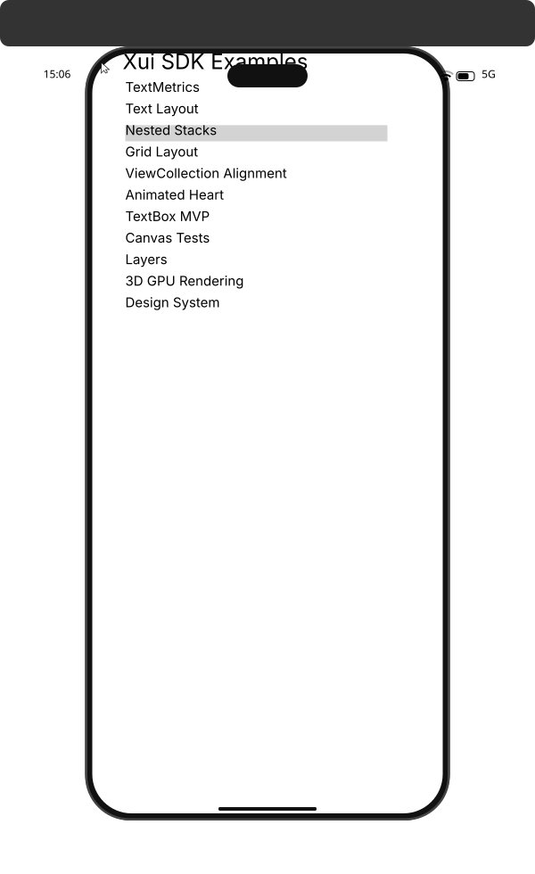

# Integration Test Run

## Timeline

# TestApp

Open the test app to see the menu with SDK examples.

## Scenario

Reproduce stale hover state after navigating to NestedStacks and back.

### 01. HomePage



### 02. HoverNestedStacks



### 03. PressedNestedStacks



### 04. NestedStacks


### 05. HoverBack


### 06. PressHoverBack



### 07. ClickedHomePage


```
Expected: returning home should clear hover state from removed views.
Validation: move mouse to a neutral position and snapshot visual state.
```

### 08. MouseMovedAway


