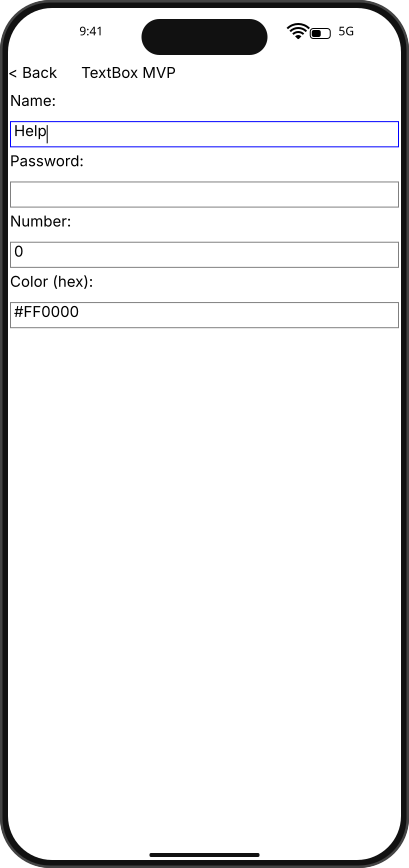

# Integration Test Run

## Timeline

# TestApp

Open the test app to see the menu with SDK examples.

## Scenario

Type text, backspace twice, then type replacement character.

### 01. BeforeBackspace

### 02. AfterBackspace

### 03. AfterRetype

