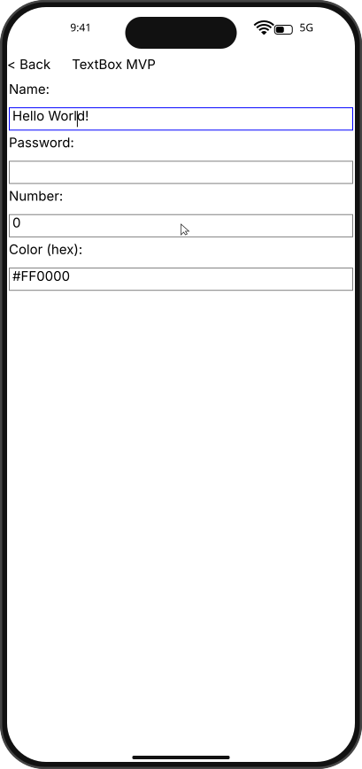
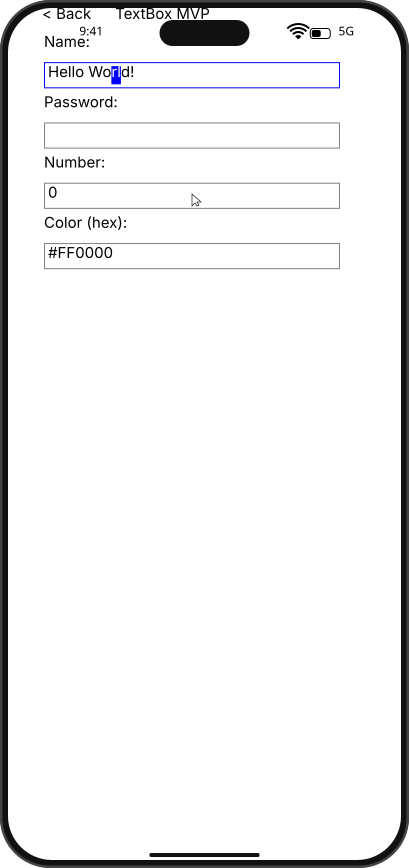
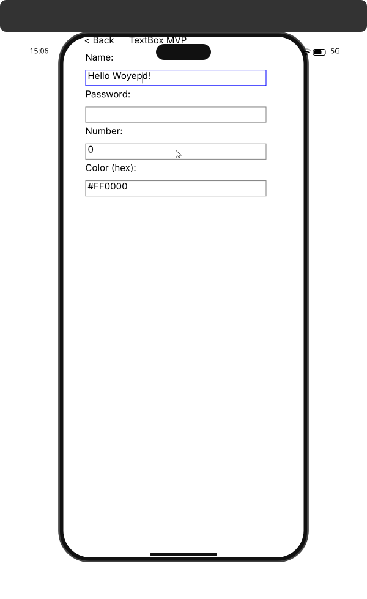

# Integration Test Run

## Timeline

# TestApp

Open the test app to see the menu with SDK examples.

## Scenario

Use keyboard selection and replacement inside NameBox.

### 01. Typed

### 02. AfterLeftLeft

### 03. ShiftSelected

### 04. AfterReplace

