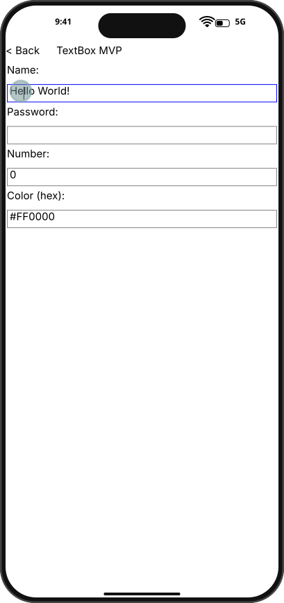
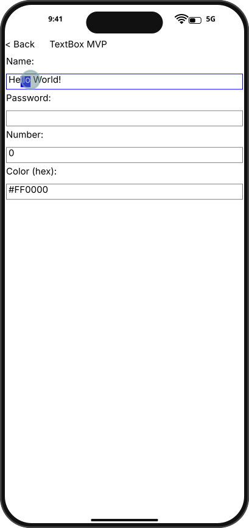
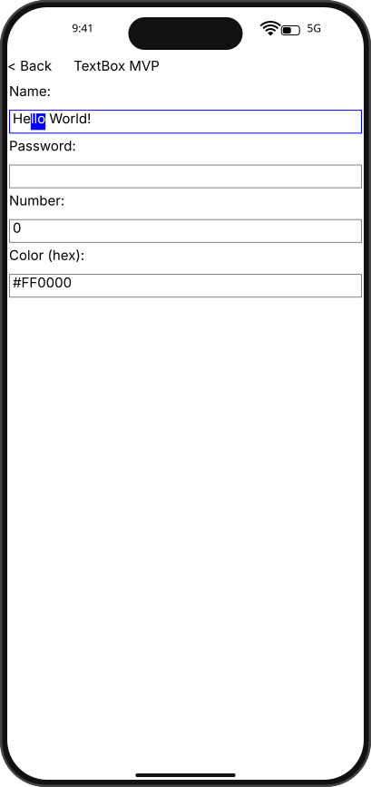

# Integration Test Run

## Timeline

# TestApp

Open the test app to see the menu with SDK examples.

## Scenario

Drag-select text range in NameBox with mouse.

### 01. MouseDown

### 02. MouseDrag

### 03. MouseUp

