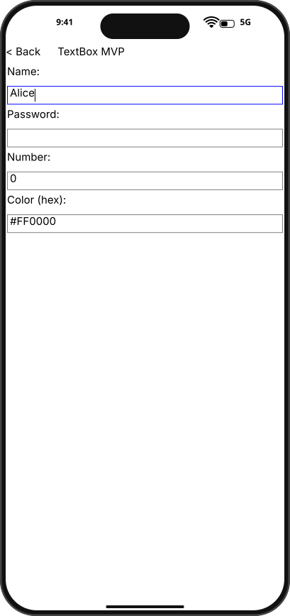
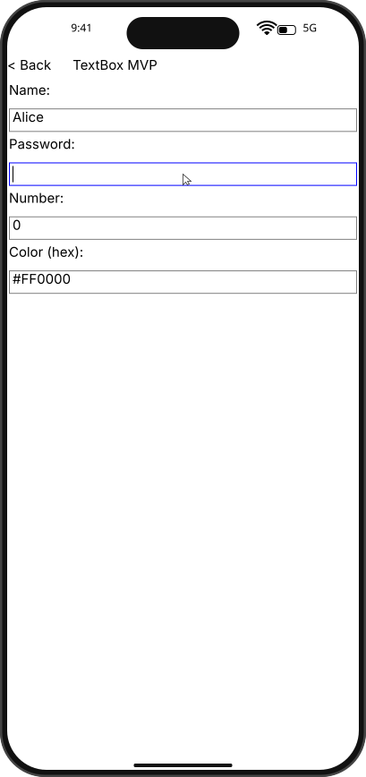
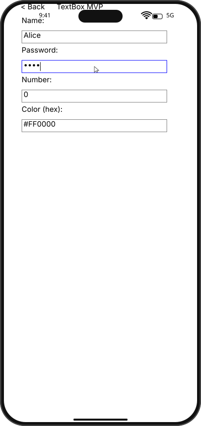

# Integration Test Run

## Timeline

# TestApp

Open the test app to see the menu with SDK examples.

## Scenario

Move focus from NameBox to PasswordBox and verify independent values.

### 01. NameFilled

### 02. PasswordFocused

### 03. PasswordFilled

