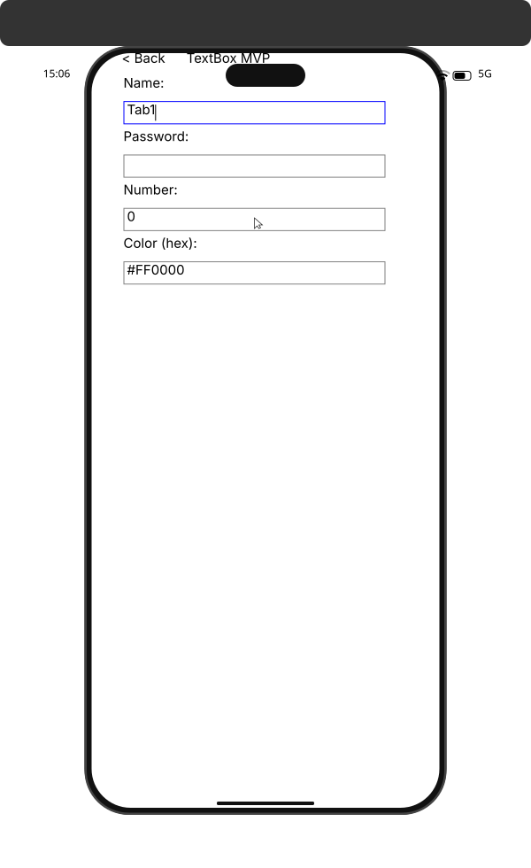
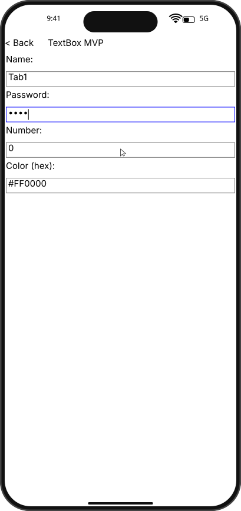
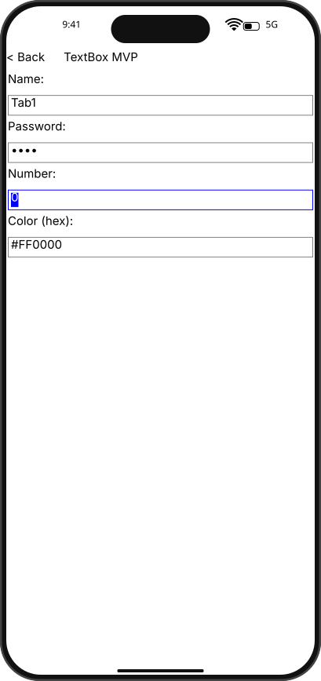
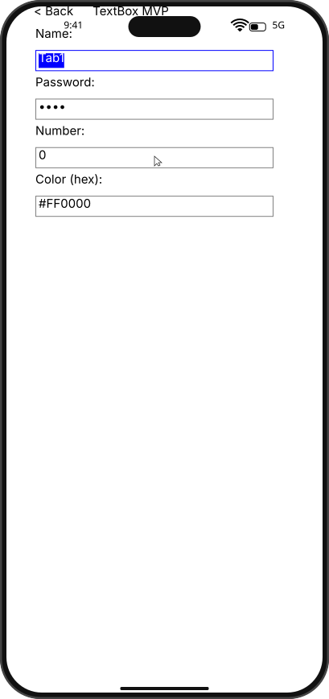
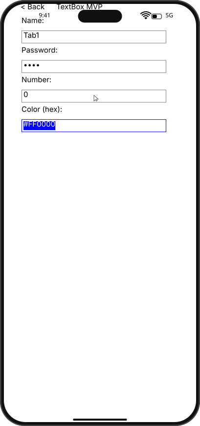

# Integration Test Run

## Timeline

# TestApp

Open the test app to see the menu with SDK examples.

## Scenario

Traverse editable controls with Tab and Shift+Tab.

- Tab to NameBox, then PasswordBox, NumberBox, ColorBox.
- Tab wraps to NameBox.
- Shift+Tab moves focus backward.

### 01. Tab.NameBox

### 02. Tab.PasswordBox

### 03. Tab.NumberBox

### 04. Tab.ColorBox

### 05. Tab.WrapToNameBox

### 06. ShiftTab.ColorBox

