# Integration Test Run

## Timeline

## Scenario

Navigate to Grid Layout and capture each scenario variant.

- Basic fixed grid
- Grid with gaps
- Fractional units
- Auto tracks
- Spanning cells
- Named areas
- Auto flow
- Alignment
- Fixed container
- Scrollable grid
- Nested grids
- MinMax tracks

### 01. GridLayout.Home

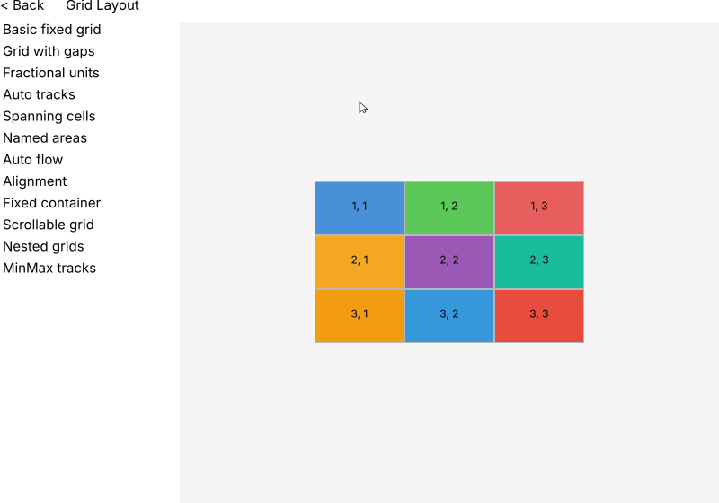

### Grid Scenario: Basic fixed grid

### 02. Basic.fixed.grid

### Grid Scenario: Grid with gaps

### 03. Grid.with.gaps

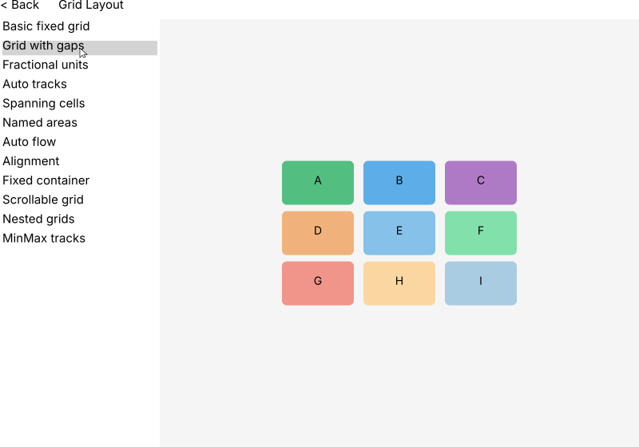

### Grid Scenario: Fractional units

### 04. Fractional.units

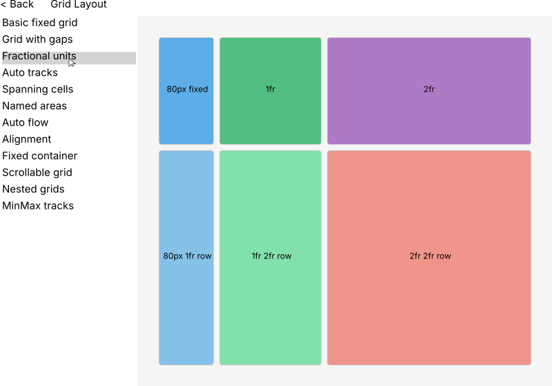

### Grid Scenario: Auto tracks

### 05. Auto.tracks

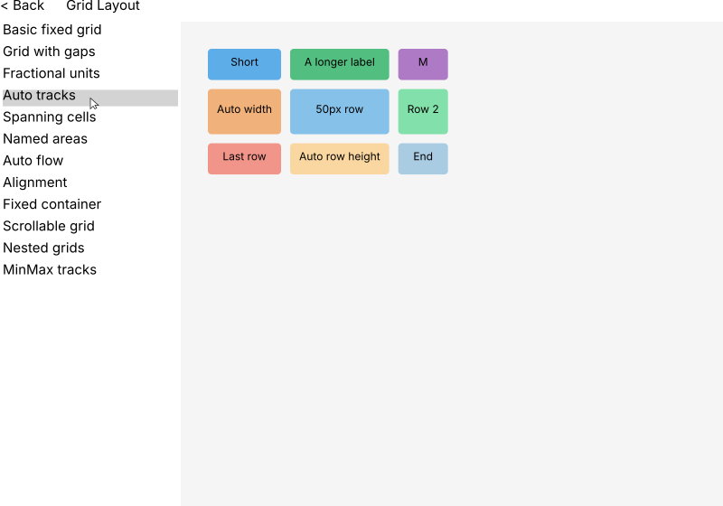

### Grid Scenario: Spanning cells

### 06. Spanning.cells

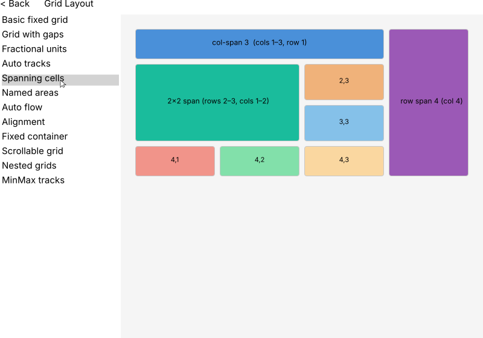

### Grid Scenario: Named areas

### 07. Named.areas

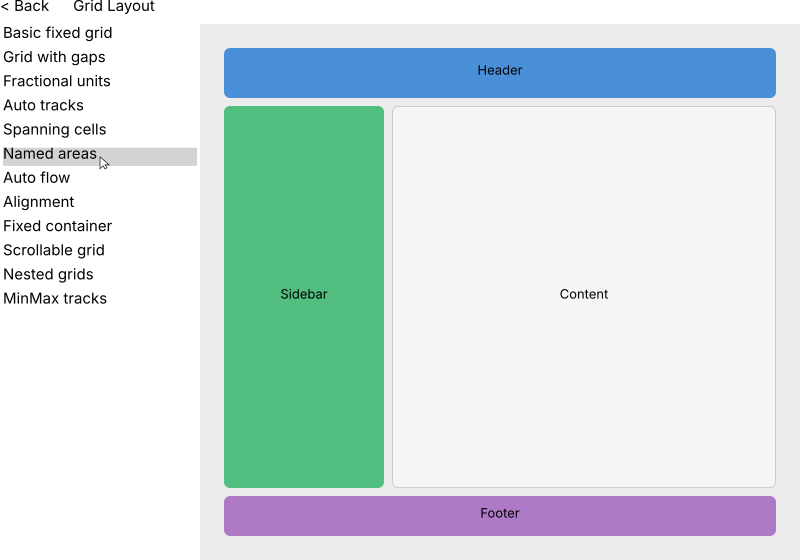

### Grid Scenario: Auto flow

### 08. Auto.flow

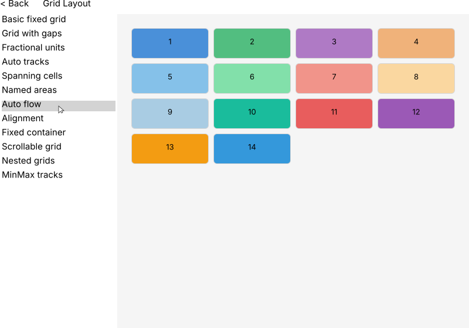

### Grid Scenario: Alignment

### 09. Alignment

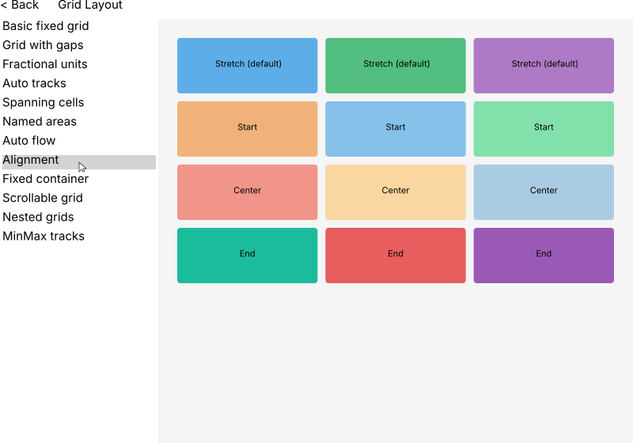

### Grid Scenario: Fixed container

### 10. Fixed.container

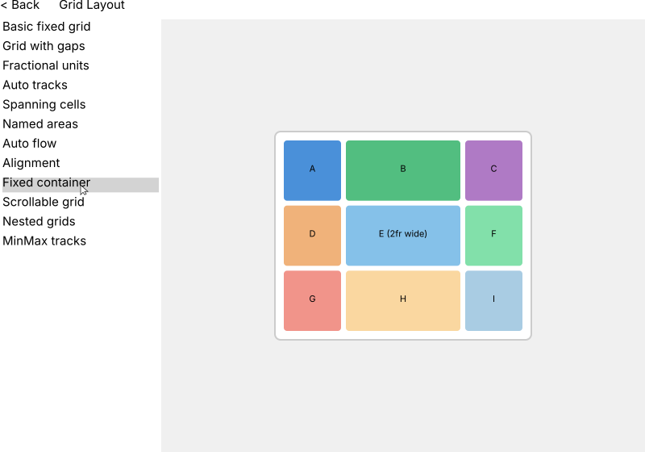

### Grid Scenario: Scrollable grid

### 11. Scrollable.grid

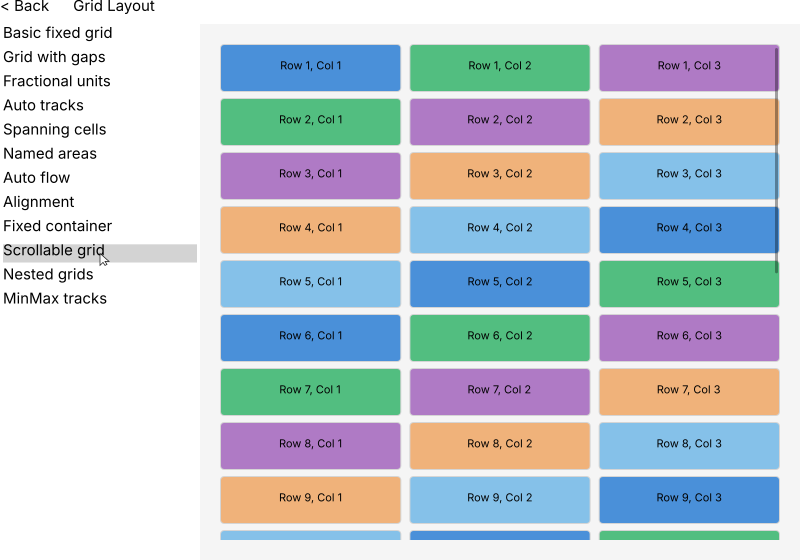

### Grid Scenario: Nested grids

### 12. Nested.grids

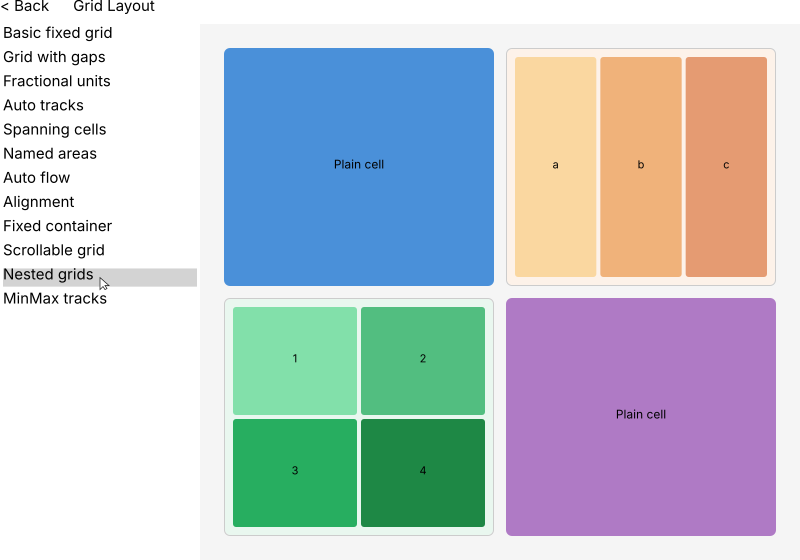

### Grid Scenario: MinMax tracks

### 13. MinMax.tracks

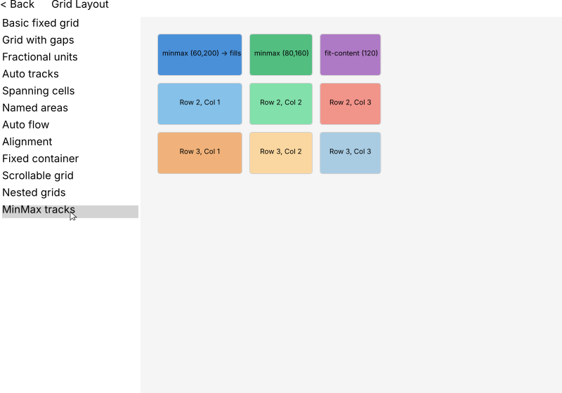

### 14. HomePage

