# Xui Design System

## Overview

This document defines the architecture and token categories for the Xui Design System — a timeless,
cross-platform, cross-form-factor visual language for Xui applications. The goal is to let application
authors write UI once and have it feel natural on every device: a phone, a tablet, a desktop, a car
screen, or a TV — the way a Spotify app feels consistent yet adapts to context.

The design system is pure **data + math**. There are no CSS variables, no DOM elements per cell, no
pseudo-selectors. Instead, widgets query a typed `IDesignSystem` interface at attach time (or when the
system changes) and use the returned values directly in their rendering code.

---

## 1. Research: Modern Cross-Platform Design Systems

### 1.1 Material Design 3 (Google)

Material Design 3 (Material You, 2021) is the most data-driven public design system to date.

**Key ideas**
- **Dynamic Color** — generates a full tonal palette from a single seed color using the HCT (Hue,
  Chroma, Tone) color space, which is perceptually uniform relative to human vision.
- **Color roles** — named slots (Primary, Secondary, Tertiary, Error, Surface, Outline, …) each having
  a *container* variant and an *on-container* text/icon color, giving 28+ semantic color tokens.
- **Typography scale** — five levels (Display, Headline, Title, Body, Label) × three sizes, all with
  explicit size, line-height, letter-spacing, and weight defaults.
- **Shape** — five shape families (None, Extra-Small, Small, Medium, Large, Full) mapped to corner
  radius values.  Each component is assigned a shape category.
- **Motion** — "Expressive" tokens: `Emphasized`, `EmphasizedDecelerate`, `EmphasizedAccelerate`, and
  `Standard`, each a cubic Bezier with explicit duration ranges.
- **Elevation** — surface tinting at different levels replaces drop-shadows for expressing depth.

**Strengths**: Mathematically derivable from one seed color; excellent accessibility math (contrast
ratio checking baked in).  
**Limitation**: Web/Android-first; relies on platform-native theming hooks that don't exist in Xui.

---

### 1.2 Apple Human Interface Guidelines (Cupertino)

Apple's HIG is narrative rather than token-based but implies a coherent set of choices:

**Key ideas**
- **Semantic colors** — `systemBackground`, `secondarySystemBackground`, `label`, `secondaryLabel`, etc.
  Automatically switch between light and dark, and between different contrast modes.
- **Dynamic Type** — text size levels (`largeTitle`, `title1` … `caption2`) scale with the user's
  Accessibility font size preference.  Each level has a minimum size floor.
- **Vibrancy / materials** — blur-based translucency (`.ultraThinMaterial`, `.regularMaterial`, etc.)
  adapt foreground colors to whatever is behind the view.
- **SF Symbols** — vector icons whose weight and scale match the surrounding text weight and size.
- **Corner radius** — contextually scaled: `12 pt` for cards, `10 pt` for buttons, `8 pt` for text
  fields, fully round for pills and toggles.
- **Animation** — spring-based (`damping`, `initialVelocity`) rather than duration/easing.

**Strengths**: Deep accessibility integration; system-level dark mode; rich haptics model.  
**Limitation**: Heavily platform-tied; not trivially portable to non-Apple platforms.

---

### 1.3 Flutter (Material + Cupertino + Custom)

Flutter abstracts both Material and Cupertino behind a `ThemeData` tree that resolves through the
widget `BuildContext`, analogous to Xui's parent-chain DI:

```dart
// Provider at the root
MaterialApp(theme: ThemeData(colorScheme: ColorScheme.fromSeed(seedColor: Colors.deepPurple)));

// Consumer deep in the tree
final color = Theme.of(context).colorScheme.primary;
```

**Key ideas**
- `ThemeData` is a single immutable snapshot injected at the `MaterialApp` root.
- `ColorScheme` encodes all Material 3 color roles (derived via `ColorScheme.fromSeed`).
- `TextTheme` encodes the typography scale.
- `ShapeBorderTheme` maps component types to shape families.
- **Component-level overrides** — e.g. `ButtonThemeData`, `InputDecorationTheme` allow fine-grained
  per-component token overrides without touching the global theme.
- `ThemeExtension<T>` allows apps to inject custom typed sub-themes.

**Strengths**: Context-driven resolution is exactly the DI model Xui already uses; rich component
override story; well-documented.

---

### 1.4 Microsoft Fluent Design System

Fluent 2 (WinUI 3, Teams, Microsoft 365) defines:

**Key ideas**
- **Color ramp** — each brand color generates a ramp of 10 tints (10 % lighter) and 10 shades (10 %
  darker); semantic aliases (`neutralForeground1`, `brandBackground1`, etc.) map ramp stops to roles.
- **Typography** — `Caption1`, `Body1`, `Body1Strong`, `Body2`, `Subtitle1`, `Subtitle2`, `Title1`,
  `Title2`, `Title3`, `LargeTitle`, `Display` — all with explicit `font-weight`, `font-size`, and
  `line-height` values.
- **Geometry / Shape** — `borderRadiusNone (0)`, `borderRadiusSmall (2)`, `borderRadiusMedium (4)`,
  `borderRadiusLarge (6)`, `borderRadiusXLarge (8)`, `borderRadiusCircular (9999)`.
- **Spacing** — baseline 4 pt grid: `spacingHorizontalNone (0)`, `…XXS (2)`, `…XS (4)`, `…S (8)`,
  `…M (12)`, `…L (16)`, `…XL (20)`, `…XXL (24)`, `…XXXL (32)`.
- **Elevation** — shadow levels (2, 4, 8, 16, 28, 64) with explicit shadow color, blur, and spread.
- **Motion** — `durationUltraFast (50 ms)` … `durationSlow (400 ms)`; standard easing curves.

---

### 1.5 IBM Carbon Design System

IBM Carbon targets enterprise / data-heavy applications:

**Key ideas**
- Strict 8 pt spacing grid with 2 pt sub-grid for dense UI.
- **Size variants** for every component: `sm`, `md`, `lg` — maps to both height and padding.
- Two-layer neutral palette: Gray 10 (light) and Gray 100 (dark) with 10-step tonal ramps for each
  functional color.
- Explicit **interactive states**: enabled, hover, active, focus, disabled, skeleton/loading.
- **Type scale** is geometric: each level × 1.25 the previous.

---

### 1.6 Radix Primitives / Radix Themes

Radix targets cross-browser accessible primitives first, then layers tokens on top:

**Key ideas**
- **Gray scale** — nine functional grays (1–12) derived for both light and dark.
- **Accent scale** — same nine slots applied to any of 30 color families; same mathematical derivation.
- **Type scale** — `1` (xs) … `9` (2xl), font-size + letter-spacing co-derived.
- **Radius** — `1 (3 px)` … `6 (full)` with a global `--radius-factor` multiplier that scales all radii.
- **Space** — `1 (4 px)` … `9 (40 px)`; component padding maps to named space tokens.

---

### 1.7 Comparative Summary

| Aspect | Material 3 | Cupertino | Fluent 2 | Carbon | Radix |
|---|---|---|---|---|---|
| Color derivation | HCT tonal palette from seed | Semantic system colors | Brand ramp + semantic aliases | Functional tonal ramps | Scale 1–12 per hue |
| Dark mode | Auto via tonal roles | Auto via semantic colors | Auto via semantic aliases | Two separate palettes | Auto via scale |
| Typography scale | 15 named slots | 12 Dynamic Type levels | 12 named slots | Geometric × 1.25 | 9 size tokens |
| Shape / radius | 6 families per component | Context-scaled points | 6 named radii | Strict sizes per component | 6 levels + factor |
| Spacing | 4 pt grid | 8/12/16 multiples | 4 pt grid | 8 pt grid / 2 pt sub-grid | 4 pt grid |
| Motion | 4 easing tokens + durations | Spring-based | 5 duration tokens + easings | Duration-based | N/A |
| Form-factor | Adaptive layouts | Size classes | Adaptive panels | Responsive columns | N/A |
| DI / context | Context-tree (`Theme.of`) | Environment (SwiftUI) | N/A (CSS variables) | N/A (CSS vars) | N/A (CSS vars) |

**Takeaways for Xui**:
1. Color must derive from a small seed set using **color-space math** (not hardcoded tables).
2. Typography must participate in **accessibility scaling** (Dynamic Type equivalent).
3. All tokens must be **named and typed** so widgets read them programmatically.
4. Context-tree resolution (like Flutter's `Theme.of`) is already native to Xui's parent-chain DI.
5. Components should map to shape **families**, not hardcoded point values, so the entire app can shift
   roundness with one knob.
6. Motion tokens must distinguish **physics-based** (springs) from **curve-based** (Bezier) so the
   "bouncy art app vs stiff business app" axis is explicit.
7. Icons and drawables must be an **abstraction** that lets platform providers supply native vectors or
   custom renderers.

---

## 2. Device and Form-Factor Model

### 2.1 Device Idiom

```
IDeviceInfo
├── Idiom: Mobile | Tablet | Desktop | Car | TV | Watch
├── PointerModel: Touch | Stylus | Mouse | Controller | Eye
└── Scale: nfloat  (physical px per logical pt, e.g. 2.0 for Retina)
```

| Idiom | Pointer | Typical primary hit-test radius | Layout density |
|---|---|---|---|
| Mobile | Touch | 44 pt (Apple) / 48 dp (Material) | Compact |
| Tablet | Touch + Stylus | 44 pt touch, 16 pt stylus | Regular |
| Desktop | Mouse | 8–16 pt | Dense |
| Car | Touch | 60 pt (driver distraction) | Very coarse |
| TV | D-pad / Eye | N/A | Very large text |
| Watch | Touch | 44 pt but very small canvas | Ultra-compact |

### 2.2 Hit-Test Area vs Visual Size

Large hit-test area does **not** mean large visual element. A search field magnifying-glass icon may
render at 16 pt but have a 44 pt tappable region:

```
┌──────────────────────────────────────────────────────┐
│  Hit area (44 × 44 pt transparent, touch-only)       │
│       ╔══════════════╗                                │
│       ║  Search icon ║  ← visual: 16 × 16 pt         │
│       ║   🔍  16pt   ║                                │
│       ╚══════════════╝                                │
└──────────────────────────────────────────────────────┘
```

The design system exposes `MinimumHitTestRadius` and widgets use it when computing their hit-test
extension but keep their visual bounds separate.

### 2.3 Spotify Paradigm: Same App, Different Idiom

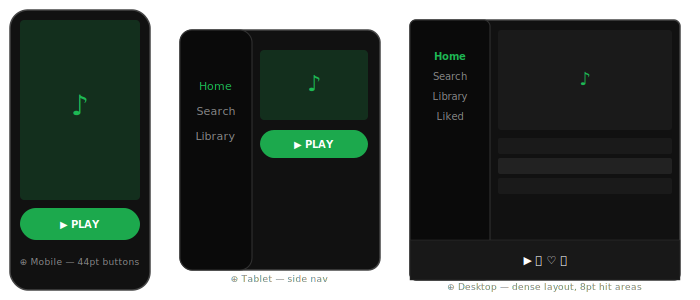

The same `IDesignSystem` feeds all three — only `IDeviceInfo.Idiom` and `MinimumHitTestRadius` change.

---

## 3. Design Token Categories

### 3.1 Color System

#### 3.1.1 Seed → Palette Math

The Xui color system starts from **one to four seed hues** and derives a complete set of roles using
**HSL / OKLCH interpolation**:

1. **Primary hue** (brand identity color)
2. **Secondary hue** (optional; if omitted, derived as the split-complementary at ±150°)
3. **Tertiary hue** (optional; at ±90° or user-specified)
4. **Neutral hue** (optional; typically the primary hue desaturated 90 %)

Each hue generates a **tonal ramp** of 13 stops: `0, 5, 10, 20, 30, 40, 50, 60, 70, 80, 90, 95, 100`.

Color-scheme relationships:

| Scheme | Formula (H = primary hue in degrees) |
|---|---|
| Complementary | Secondary = H + 180° |
| Split-complementary | Secondary = H + 150°, Tertiary = H + 210° |
| Triadic | Secondary = H + 120°, Tertiary = H + 240° |
| Tetradic | Secondary = H + 90°, Tertiary = H + 180°, Quaternary = H + 270° |
| Analogous | Secondary = H + 30°, Tertiary = H + 60° |

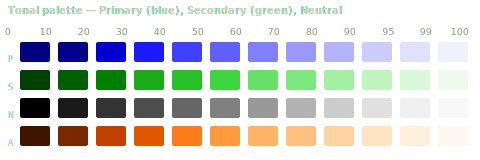

#### 3.1.2 `Color.Oklch` — Perceptual Color Space and Ramps

Interpolating between two colors straight in sRGB produces muddy, de-saturated midpoints. The
solution is to work in a **perceptual color space** first. Xui extends `Color` with a nested
`Color.Oklch` value type representing the standard **OKLCH** color space (Oklab-based Lightness,
Chroma, Hue — the same space used by CSS Color Level 4 and Material Design 3's HCT):

- **Lightness** (0.0–1.0) — perceptual lightness (0 = black, 1 = white)
- **Chroma** (0.0–~0.4) — colorfulness; 0 = neutral/gray, higher = fully saturated
- **Hue** (0–360 °) — perceptual hue angle on the color wheel

Conversion to/from `Xui.Core.Canvas.Color` is implicit, so existing APIs are unaffected. The key
addition is `Color.Oklch.Ramp` — a struct that **binds two `Color.Oklch` endpoints** and evaluates to
any intermediate color via `[t]` indexing, exactly like how `Xui.Core.Curves2D` interpolates points
along a Bezier curve.

```csharp
// In Xui.Core.Canvas (extends the existing Color struct):
public partial struct Color
{
    /// <summary>
    /// OKLCH perceptual color space (Oklab-based Lightness, Chroma, Hue).
    /// Interpolation in OKLCH produces vivid, perceptually uniform color transitions.
    /// See: https://bottosson.github.io/posts/oklab/
    /// </summary>
    public readonly struct Oklch
    {
        /// <summary>Perceptual lightness (0.0 = black, 1.0 = white).</summary>
        public nfloat Lightness { get; init; }

        /// <summary>Colorfulness (0.0 = neutral gray; typical max ~0.37 for sRGB gamut).</summary>
        public nfloat Chroma    { get; init; }

        /// <summary>Hue angle in degrees (0–360).</summary>
        public nfloat Hue       { get; init; }

        /// <summary>Converts an sRGB <see cref="Color"/> to OKLCH.</summary>
        public Oklch(Color color) { /* sRGB → linear sRGB → Oklab → OKLCH */ }

        /// <summary>Converts this OKLCH value back to sRGB <see cref="Color"/>.</summary>
        public Color ToColor() { /* OKLCH → Oklab → linear sRGB → sRGB */ }

        public static implicit operator Color(Oklch oklch)   => oklch.ToColor();
        public static implicit operator Oklch(Color color) => new Oklch(color);

        /// <summary>
        /// Creates a <see cref="Ramp"/> between two Oklch colors.
        /// Hue interpolation follows the shortest arc on the color wheel.
        /// </summary>
        public static Ramp Between(Oklch from, Oklch to) => new Ramp(from, to);

        /// <summary>
        /// A pair of Oklch endpoints that can be evaluated at any position t ∈ [0, 1].
        /// Analogous to how <c>Xui.Core.Curves2D</c> evaluates a point on a Bezier curve.
        /// t = 0 returns From; t = 1 returns To.
        /// </summary>
        public readonly struct Ramp
        {
            public Oklch From { get; init; }
            public Oklch To   { get; init; }

            public Ramp(Oklch from, Oklch to) { From = from; To = to; }

            /// <summary>Evaluates the ramp at position t, returning a sRGB Color.</summary>
            public Color this[nfloat t] => Lerp(From, To, t).ToColor();

            /// <summary>Lerps two Oklch values along the shortest hue arc.</summary>
            public static Oklch Lerp(Oklch from, Oklch to, nfloat t)
            {
                nfloat dHue = to.Hue - from.Hue;
                if (dHue >  180) dHue -= 360;
                if (dHue < -180) dHue += 360;
                return new Oklch
                {
                    Lightness = from.Lightness + (to.Lightness - from.Lightness) * t,
                    Chroma    = from.Chroma    + (to.Chroma    - from.Chroma)    * t,
                    Hue       = from.Hue       + dHue                            * t,
                };
            }
        }
    }
}
```

**Generating a tonal ramp** for any hue is then one expression:

```csharp
// Full tonal ramp for hue 240 ° (blue), chroma 0.3:
var blueRamp = Color.Oklch.Between(
    new Color.Oklch { Lightness = 0.0f, Chroma = 0.3f, Hue = 240 },  // L=0 → near black
    new Color.Oklch { Lightness = 1.0f, Chroma = 0.0f, Hue = 240 }   // L=1 → near white
);

Color primary40 = blueRamp[0.40f];  // Filled button fill    (light mode)
Color primary80 = blueRamp[0.80f];  // Filled button fill    (dark mode)
Color primary90 = blueRamp[0.90f];  // Tonal button fill     (light mode)
Color primary30 = blueRamp[0.30f];  // Tonal button fill     (dark mode)
```

`IColorSystem.GetTonalRamp(nfloat hueDegrees, nfloat chroma)` returns a pre-built `Color.Oklch.Ramp`
for that hue. `ColorGroup` (see below) exposes the ramp for each semantic role so widgets can build
hover/press overlays without hard-coding any color values.

---

#### 3.1.3 `ColorGroup` — Semantic Four-Color Bundle

Traditional design tokens expose `Primary`, `OnPrimary`, `PrimaryContainer`, and
`OnPrimaryContainer` as four independent properties. This is verbose and makes the relationship
between them opaque. Xui wraps them into a **`ColorGroup`** — a single struct with four named roles
and the underlying `Ramp`:

```
Background   ←→  Foreground    (strong pair — use for filled elements)
Container    ←→  OnContainer   (light pair  — use for tinted/highlighted elements)
```

| Role | Light-mode tonal stop | Dark-mode tonal stop | Typical use |
|---|---|---|---|
| `Background` | Hue ramp @ 0.40 | Hue ramp @ 0.80 | Filled button fill, active tab indicator |
| `Foreground` | Hue ramp @ 1.00 | Hue ramp @ 0.20 | Label inside a filled button or active icon |
| `Container` | Hue ramp @ 0.90 | Hue ramp @ 0.30 | Tonal button fill, chip, selected segment |
| `OnContainer` | Hue ramp @ 0.10 | Hue ramp @ 0.90 | Label inside a chip or tonal button |

**Why two pairs?**

- **`Background + Foreground`** → high-contrast, saturated pair. Use when the element *is* the call
  to action: a filled primary button, the active indicator dot in a nav rail.
- **`Container + OnContainer`** → lower-contrast, tinted pair. Use when the element *indicates* a
  selected or important state without screaming: a tonal button in a button group, an active chip,
  a highlighted list row.

**`Application` and `Surface` groups** follow the same pattern but draw from the **Neutral** ramp:

| Group | Background | Foreground | Container | OnContainer | Purpose |
|---|---|---|---|---|---|
| `Application` | Neutral 0.99 / 0.06 | Neutral 0.10 / 0.90 | Neutral 0.98 / 0.12 | Neutral 0.10 / 0.90 | Window canvas & body text |
| `Surface` | Neutral 0.98 / 0.12 | Neutral 0.10 / 0.90 | Neutral 0.90 / 0.30 | Neutral 0.30 / 0.80 | Card / panel fill & text |

`Application.Background` is the window/screen canvas. `Surface.Background` is a card resting on
that canvas.  `Surface.Container` is a slightly differentiated alternate fill (e.g. alternating table
rows, a hover highlight on a list item).

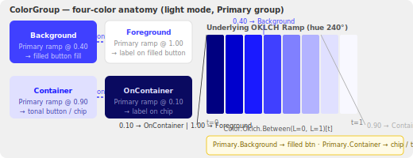

> **Implementation note**: `IColorSystem.GetTonalRamp(hue, chroma)` returns a `Color.Oklch.Ramp`.
> Each `ColorGroup` also exposes this ramp directly as a `Ramp` property, so widgets can build
> hover/pressed overlays via `Primary.Ramp[pressedLightness]` without any hardcoded color values.

---

### 3.2 Typography

The typography system defines a **scale** of named text styles.  Each style carries:

| Property | Type | Description |
|---|---|---|
| `FontFamily` | `string` | Family name (defaults to app-level `DefaultFontFamily`) |
| `FontSize` | `nfloat` | Size in points; scaled by `AccessibilityFontScale` |
| `LineHeight` | `nfloat` | In points (not a multiplier) |
| `LetterSpacing` | `nfloat` | Additional tracking in points |
| `FontWeight` | `FontWeight` | 100–900 |
| `FontStyle` | `FontStyle` | Normal / Italic |

**Named scale levels**:

| Level | Default Size | Weight | Use |
|---|---|---|---|
| `Display` | 57 | 400 | Hero, marketing, splash |
| `HeadlineLarge` | 32 | 400 | Page title |
| `HeadlineMedium` | 28 | 400 | Section title |
| `HeadlineSmall` | 24 | 400 | Sub-section |
| `TitleLarge` | 22 | 400 | List group header |
| `TitleMedium` | 16 | 500 | Card header, toolbar |
| `TitleSmall` | 14 | 500 | Tab label, chip |
| `BodyLarge` | 16 | 400 | Reading text |
| `BodyMedium` | 14 | 400 | Default UI text |
| `BodySmall` | 12 | 400 | Secondary text |
| `LabelLarge` | 14 | 500 | Button, link |
| `LabelMedium` | 12 | 500 | Badge, tag |
| `LabelSmall` | 11 | 500 | Caption, metadata |

`AccessibilityFontScale` is a `nfloat` multiplier (default `1.0`) provided by `IDeviceInfo` and
reflecting the user's platform accessibility font size preference. Widgets multiply every `FontSize` by
this value.

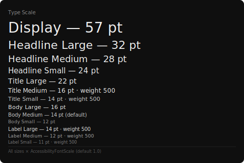

---

### 3.3 Spacing

A **4 pt base grid**. Named tokens:

| Token | Value |
|---|---|
| `Spacing.None` | 0 |
| `Spacing.XXS` | 2 |
| `Spacing.XS` | 4 |
| `Spacing.S` | 8 |
| `Spacing.M` | 12 |
| `Spacing.L` | 16 |
| `Spacing.XL` | 24 |
| `Spacing.XXL` | 32 |
| `Spacing.XXXL` | 48 |

Component defaults:

| Component | Internal padding | Recommended margin |
|---|---|---|
| Button (default) | H: `L` (16) · V: `S` (8) | `XS` (4) |
| Button (compact, density-reduced) | H: `M` (12) · V: `XS` (4) | `XXS` (2) |
| TextBox / Input | H: `M` (12) · V: `S` (8) | `XS` (4) |
| Card / Surface | All sides: `L` (16) | `S` (8) |
| Section header | H: `L` (16) · V: `S` (8) | — |
| List row | H: `L` (16) · V: `S` (8) | — |
| Icon | Touch target extended to `MinimumHitTestRadius × 2` | — |

`MinimumHitTestRadius` is derived from `IDeviceInfo.PointerModel`:

```
PointerModel.Touch   → 22 pt  (44 pt diameter)
PointerModel.Stylus  → 10 pt  (20 pt diameter)
PointerModel.Mouse   →  4 pt  ( 8 pt diameter)
PointerModel.Eye     →  0 pt  (focus-based)
```

---

### 3.4 Roundness (Shape)

A **single `CornerStyle` enum** maps to a `CornerRadius` multiplied by a global `RoundnessFactor`:

| CornerStyle | Base radius | × `RoundnessFactor` (default 1.0) |
|---|---|---|
| `None` | 0 | 0 |
| `ExtraSmall` | 2 | 2 |
| `Small` | 4 | 4 |
| `Medium` | 8 | 8 |
| `Large` | 12 | 12 |
| `ExtraLarge` | 16 | 16 |
| `Full` | 9999 (pill) | 9999 |

`RoundnessFactor` is a `nfloat` (0.0 = all square, 1.0 = default, 2.0 = very round). Setting it above
`1.0` multiplies every base radius proportionally (capped at `Full`).

Component shape defaults:

| Component | CornerStyle |
|---|---|
| Button (filled) | `Full` |
| Button (outlined) | `Full` |
| Chip | `Small` |
| Card | `Large` |
| TextBox | `Small` |
| Dialog | `ExtraLarge` |
| BottomSheet | `Large` (top corners only) |
| Navigation rail | `None` |

---

### 3.5 Animation

Two categories of motion tokens:

#### Curve-based (Bezier)

| Token | Cubic Bezier | Duration range | Use |
|---|---|---|---|
| `Motion.EmphasizedDecelerate` | (0.05, 0.7, 0.1, 1.0) | 400–500 ms | Elements entering the screen |
| `Motion.EmphasizedAccelerate` | (0.3, 0.0, 0.8, 0.15) | 200–300 ms | Elements leaving the screen |
| `Motion.Standard` | (0.2, 0.0, 0.0, 1.0) | 300–500 ms | General transitions |
| `Motion.StandardDecelerate` | (0.0, 0.0, 0.0, 1.0) | 250–400 ms | Settling transitions |
| `Motion.StandardAccelerate` | (0.3, 0.0, 1.0, 1.0) | 200–300 ms | Quick dismissals |
| `Motion.Linear` | (0.0, 0.0, 1.0, 1.0) | any | Progress bars, continuous |

#### Spring-based (Physics)

| Token | Stiffness | Damping | Use |
|---|---|---|---|
| `Motion.SpringBouncy` | 600 | 0.5 | Art / lifestyle apps, button press |
| `Motion.SpringResponsive` | 300 | 0.8 | Default interactive feedback |
| `Motion.SpringSmooth` | 200 | 1.0 (critically damped) | Business / utility apps, modals |

`IMotionSystem.Preference` is `Curve` or `Spring`; apps or platform adapters set this to match the
desired personality. Individual widget authors query it and choose their animation strategy.

The global `ReducedMotion` bool (from `IDeviceInfo.PrefersReducedMotion`) disables all non-essential
transitions.

---

### 3.6 Icons and Drawables

Icons are expressed as `IDrawable` — a zero-allocation interface invoked during the render pass:

```csharp
public interface IDrawable
{
    /// Render this drawable into `context` within `frame`.
    void Draw(IContext context, Rect frame);

    /// Intrinsic size hint; (0,0) means unconstrained.
    Size IntrinsicSize { get; }
}
```

The icon system registers **named drawables** that can be overridden per-platform:

```
IIconSystem
├── GetIcon(IconName name) : IDrawable
└── RegisterIcon(IconName name, IDrawable drawable)
```

**Well-known icon names** (non-exhaustive):

| Category | Names |
|---|---|
| Navigation | `ChevronDown`, `ChevronRight`, `ChevronLeft`, `ChevronUp` |
| Actions | `Close`, `Add`, `Remove`, `Edit`, `Confirm`, `Search` |
| Data | `SortAscending`, `SortDescending`, `Filter`, `Download`, `Upload` |
| State | `CheckboxEmpty`, `CheckboxChecked`, `CheckboxIndeterminate`, `RadioOff`, `RadioOn` |
| Feedback | `ErrorCircle`, `WarningTriangle`, `InfoCircle`, `SuccessCircle` |

Platform adapters may supply vector paths from SF Symbols, Fluent Icons, or custom SVG path data.
Custom effects (ripple animations, loading spinners, lottie-style animations) are also `IDrawable`
implementations.

---

## 4. C# Interface Design

The design system is a **service** resolved via Xui's parent-chain DI — the same mechanism used for
`IFocus`, `ITextMeasureContext`, etc. Widgets call `GetService<IDesignSystem>()` in `OnAttach`.

### 4.1 Primary Interface

```csharp
namespace Xui.Core.Design;

/// <summary>
/// Root interface for the Xui Design System.
/// Resolved from the parent-chain service provider (GetService&lt;IDesignSystem&gt;()).
/// </summary>
public interface IDesignSystem
{
    /// <summary>Color tokens and palette math.</summary>
    IColorSystem Colors { get; }

    /// <summary>Typography scale.</summary>
    ITypographySystem Typography { get; }

    /// <summary>Spacing tokens derived from the 4-pt grid.</summary>
    ISpacingSystem Spacing { get; }

    /// <summary>Shape / corner-radius tokens.</summary>
    IShapeSystem Shape { get; }

    /// <summary>Motion tokens (curves and springs).</summary>
    IMotionSystem Motion { get; }

    /// <summary>Named icon and drawable registry.</summary>
    IIconSystem Icons { get; }

    /// <summary>Information about the current device and pointer model.</summary>
    IDeviceInfo Device { get; }
}
```

### 4.2 Color System Interface

```csharp
namespace Xui.Core.Design;

using Xui.Core.Canvas;

/// <summary>
/// A group of four semantically related colors derived from a single tonal palette,
/// together with the underlying Oklch ramp that generated them.
/// </summary>
public readonly struct ColorGroup
{
    /// <summary>
    /// Strong, saturated action color (ramp @ tone 0.40 light / 0.80 dark).
    /// Use as fill for filled buttons, active indicators, primary UI elements.
    /// </summary>
    public Color Background  { get; init; }

    /// <summary>
    /// High-contrast text/icon color on top of Background (ramp @ tone 1.00 light / 0.20 dark).
    /// </summary>
    public Color Foreground  { get; init; }

    /// <summary>
    /// Light tinted fill from the same palette (ramp @ tone 0.90 light / 0.30 dark).
    /// Use for tonal buttons, chips, selected segment items, highlighted list rows.
    /// </summary>
    public Color Container   { get; init; }

    /// <summary>
    /// Text/icon color on top of Container (ramp @ tone 0.10 light / 0.90 dark).
    /// </summary>
    public Color OnContainer { get; init; }

    /// <summary>
    /// The full tonal ramp for this palette entry (Lightness 0 → 1 at the group's hue).
    /// Background is at Ramp[0.40f] in light mode / Ramp[0.80f] in dark mode.
    /// Use IColorSystem.IsDark to pick the correct base Lightness, then offset:
    ///   hover   = Ramp[baseLightness + 0.08f]
    ///   pressed = Ramp[baseLightness - 0.06f]
    /// </summary>
    public Color.Oklch.Ramp Ramp { get; init; }
}

/// <summary>
/// Provides color roles derived from a seed palette, grouped into semantic <see cref="ColorGroup"/>
/// bundles and a set of neutral/structural colors.
/// </summary>
public interface IColorSystem
{
    // -- Whole-application canvas (from the Neutral ramp) --

    /// <summary>
    /// The application canvas color group.
    /// Background = window/screen fill · Foreground = body text
    /// Container  = card/panel fill    · OnContainer = card text
    /// </summary>
    ColorGroup Application { get; }

    /// <summary>
    /// The surface (card/panel) color group, slightly elevated from Application.
    /// Background = card fill  · Foreground = card body text
    /// Container  = alternate surface (e.g. alternating table row, hover bg)
    /// OnContainer = secondary text on alternate surface
    /// </summary>
    ColorGroup Surface { get; }

    // -- Borders and dividers (from Neutral ramp at mid-tones) --
    Color Outline        { get; }   // Neutral tone 0.50 light / 0.60 dark
    Color OutlineVariant { get; }   // Neutral tone 0.80 light / 0.30 dark

    // -- Semantic action groups --

    /// <summary>Brand / primary action group (from the Primary tonal ramp).</summary>
    ColorGroup Primary   { get; }

    /// <summary>Supporting / secondary action group (from the Secondary tonal ramp).</summary>
    ColorGroup Secondary { get; }

    /// <summary>Tertiary highlight / accent group (from the Accent tonal ramp).</summary>
    ColorGroup Accent    { get; }

    /// <summary>Error / destructive state group (from the Error tonal ramp).</summary>
    ColorGroup Error     { get; }

    // -- Focus ring (typically Accent.Background at full opacity) --
    Color FocusRing { get; }

    // -- Data-visualization series colors (at least 8, perceptually distinct) --
    ReadOnlySpan<Color> DataVizPalette { get; }

    /// <summary>
    /// Returns a full tonal ramp for any hue/chroma combination.
    /// Use to build custom ColorGroups or hover/press state colors.
    /// </summary>
    Color.Oklch.Ramp GetTonalRamp(nfloat hueDegrees, nfloat chroma);

    /// <summary>True if the current effective color scheme is dark.</summary>
    bool IsDark { get; }
}
```

### 4.3 Typography System Interface

```csharp
namespace Xui.Core.Design;

using Xui.Core.Canvas;

/// <summary>
/// Provides the typography scale.
/// All FontSize values are pre-multiplied by <see cref="IDeviceInfo.AccessibilityFontScale"/>.
/// </summary>
public interface ITypographySystem
{
    TextStyle Display         { get; }
    TextStyle HeadlineLarge   { get; }
    TextStyle HeadlineMedium  { get; }
    TextStyle HeadlineSmall   { get; }
    TextStyle TitleLarge      { get; }
    TextStyle TitleMedium     { get; }
    TextStyle TitleSmall      { get; }
    TextStyle BodyLarge       { get; }
    TextStyle BodyMedium      { get; }
    TextStyle BodySmall       { get; }
    TextStyle LabelLarge      { get; }
    TextStyle LabelMedium     { get; }
    TextStyle LabelSmall      { get; }

    /// <summary>The default font family used across the application.</summary>
    string DefaultFontFamily { get; }
}

/// <summary>
/// An immutable snapshot of a single text style from the typography scale.
/// </summary>
public readonly struct TextStyle
{
    public string     FontFamily     { get; init; }
    public nfloat     FontSize       { get; init; }
    public nfloat     LineHeight     { get; init; }
    public nfloat     LetterSpacing  { get; init; }
    public FontWeight FontWeight     { get; init; }
    public FontStyle  FontStyle      { get; init; }
}
```

### 4.4 Spacing System Interface

```csharp
namespace Xui.Core.Design;

/// <summary>
/// Provides spacing tokens based on a 4-pt grid.
/// </summary>
public interface ISpacingSystem
{
    nfloat None   { get; }  //  0
    nfloat XXS    { get; }  //  2
    nfloat XS     { get; }  //  4
    nfloat S      { get; }  //  8
    nfloat M      { get; }  // 12
    nfloat L      { get; }  // 16
    nfloat XL     { get; }  // 24
    nfloat XXL    { get; }  // 32
    nfloat XXXL   { get; }  // 48
}
```

### 4.5 Shape System Interface

```csharp
namespace Xui.Core.Design;

using Xui.Core.Canvas;

/// <summary>
/// Provides corner-radius tokens scaled by <see cref="RoundnessFactor"/>.
/// </summary>
public interface IShapeSystem
{
    /// <summary>Global multiplier for all corner radii (default 1.0).</summary>
    nfloat RoundnessFactor { get; }

    CornerRadius None        { get; }  //  0
    CornerRadius ExtraSmall  { get; }  //  2 × RoundnessFactor
    CornerRadius Small       { get; }  //  4 × RoundnessFactor
    CornerRadius Medium      { get; }  //  8 × RoundnessFactor
    CornerRadius Large       { get; }  // 12 × RoundnessFactor
    CornerRadius ExtraLarge  { get; }  // 16 × RoundnessFactor
    CornerRadius Full        { get; }  // 9999 (pill)
}
```

### 4.6 Motion System Interface

```csharp
namespace Xui.Core.Design;

using Xui.Core.Animation;

/// <summary>
/// Provides motion tokens for animations.
/// </summary>
public interface IMotionSystem
{
    /// <summary>Whether springs or curves are preferred for interactive feedback.</summary>
    MotionPreference Preference { get; }

    /// <summary>True if the user has requested reduced motion (accessibility).</summary>
    bool ReducedMotion { get; }

    // -- Curve-based tokens --
    CurveToken EmphasizedDecelerate  { get; }
    CurveToken EmphasizedAccelerate  { get; }
    CurveToken Standard              { get; }
    CurveToken StandardDecelerate    { get; }
    CurveToken StandardAccelerate    { get; }
    CurveToken Linear                { get; }

    // -- Spring-based tokens --
    SpringToken SpringBouncy         { get; }
    SpringToken SpringResponsive     { get; }
    SpringToken SpringSmooth         { get; }
}

public enum MotionPreference { Curve, Spring }

public readonly struct CurveToken
{
    public float P1x { get; init; }
    public float P1y { get; init; }
    public float P2x { get; init; }
    public float P2y { get; init; }
    public float DefaultDurationMs { get; init; }
}

public readonly struct SpringToken
{
    public float Stiffness { get; init; }
    public float Damping   { get; init; }
}
```

### 4.7 Icon System Interface

```csharp
namespace Xui.Core.Design;

using Xui.Core.Canvas;
using Xui.Core.Math2D;

/// <summary>
/// Named icon and drawable registry. Platform adapters register icons;
/// widgets look them up by name.
/// </summary>
public interface IIconSystem
{
    /// <summary>Returns a drawable for the given icon name, or null if not registered.</summary>
    IDrawable? GetIcon(string name);

    /// <summary>Returns an icon scaled to a specific visual size.</summary>
    IDrawable? GetIcon(string name, Size visualSize);
}

/// <summary>
/// A zero-allocation rendering primitive that draws into a canvas frame.
/// </summary>
public interface IDrawable
{
    Size IntrinsicSize { get; }
    void Draw(IContext context, Rect frame);
}
```

### 4.8 Device Info Interface

```csharp
namespace Xui.Core.Design;

/// <summary>
/// Provides device and pointer model information for layout adaptation.
/// </summary>
public interface IDeviceInfo
{
    DeviceIdiom   Idiom              { get; }
    PointerModel  PointerModel       { get; }
    nfloat        Scale              { get; }   // physical px / logical pt
    nfloat        MinimumHitTestRadius { get; } // pt
    nfloat        AccessibilityFontScale { get; } // 1.0 = default
    bool          PrefersReducedMotion  { get; }
    bool          PrefersHighContrast   { get; }
    ColorScheme   ColorScheme           { get; } // Light | Dark
}

public enum DeviceIdiom  { Mobile, Tablet, Desktop, Car, TV, Watch }
public enum PointerModel { Touch, Stylus, Mouse, Controller, Eye }
public enum ColorScheme  { Light, Dark }
```

---

## 5. Widget Design with SVG Mockups

### 5.1 Buttons

Three **importance levels** map to different `ColorGroup` properties:

| Level | Fill | Text | Border | Use |
|---|---|---|---|---|
| `FilledButton` | `Primary.Background` | `Primary.Foreground` | none | Primary CTA |
| `TonalButton` | `Primary.Container` | `Primary.OnContainer` | none | Secondary CTA |
| `OutlinedButton` | transparent | `Primary.Background` | `Outline` | Tertiary CTA |
| `TextButton` | transparent | `Primary.Background` | none | Low-prominence action |

**Corner radius**: `Shape.Full` (pill) by default.

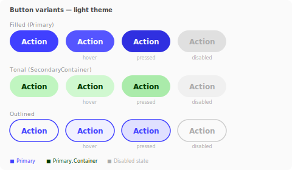

#### 5.1.1 Button Group (Segment Control)

Three or more buttons sharing a border, with one marked `IsActive`. The active button uses
`Primary.Container` fill + `Primary.OnContainer` text; inactive buttons use `Surface.Container`:

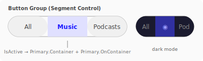

---

### 5.2 TextBox and Input Fields

A `TextBox` queries design tokens at `OnAttach` and applies them to its `BorderLayer`:

```csharp
// Inside a custom TextBox-style widget's OnAttach:
var ds = GetService<IDesignSystem>()!;
_borderLayer.CornerRadius    = ds.Shape.Small;
_borderLayer.BorderColor     = ds.Colors.Outline;
_borderLayer.BackgroundColor = ds.Colors.Surface.Background;
_borderLayer.Padding         = new Frame(ds.Spacing.M, ds.Spacing.S);
_labelStyle                  = ds.Typography.BodyMedium;
_focusColor                  = ds.Colors.FocusRing;
_errorColor                  = ds.Colors.Error.Background;
_errorBgColor                = ds.Colors.Error.Container;
```

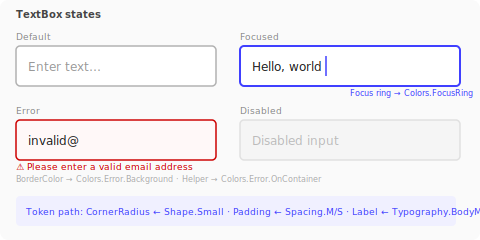

---

### 5.3 SearchBox — Visual Size vs Hit-Test Area

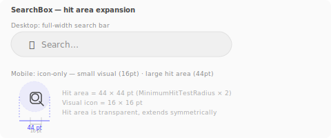

---

### 5.4 Navigation Patterns

#### Bottom navigation (mobile) vs Navigation rail (desktop/tablet)

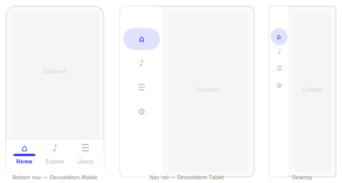

---

### 5.5 Cards — `Surface` ColorGroup in Action

Cards are the primary container that elevates content above the `Application.Background`. They use
`Surface.Background` as fill. Buttons inside the card use `Primary.Background`.

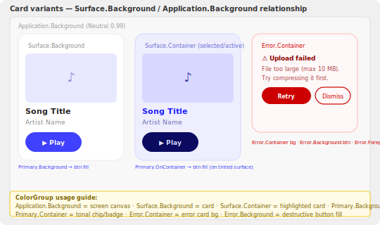

---

### 5.6 Form Layout — Token Flow Across Grouped Inputs

A form groups labels, inputs, and helper/error text. Every element resolves its color from the same
`IDesignSystem` instance queried once in `OnAttach`.

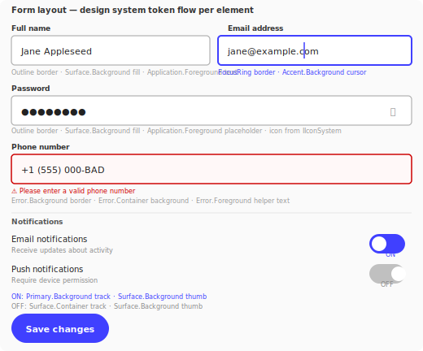

---

### 5.7 Toggle / Switch — State via ColorGroup

The toggle (on/off switch) demonstrates how a single `ColorGroup` drives all visual states:

| State | Track fill | Thumb fill |
|---|---|---|
| Off | `Surface.Container` | `Surface.Background` |
| Off + hover | `Surface.Container` + lightened via `Surface.Ramp` | `Surface.Background` |
| On | `Primary.Background` | `Primary.Foreground` |
| On + hover | `Primary.Ramp[0.48f]` | `Primary.Foreground` |
| Disabled | `OutlineVariant` | `Surface.Background` |

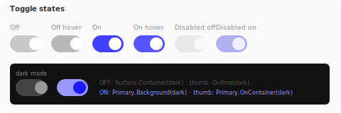

---

### 5.8 Chips / Tags — `Container` + `OnContainer`

Chips are the canonical use of `Container + OnContainer` within a `ColorGroup`. They show
classification, filter state, or attribute labels.

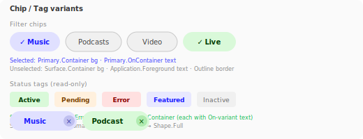

---

### 5.9 Dialog / Modal — Elevation and Surface Hierarchy

A dialog sits above the application layer. Its scrim uses `Application.Background` at reduced opacity;
the dialog surface uses `Surface.Background` elevated via a subtle shadow.

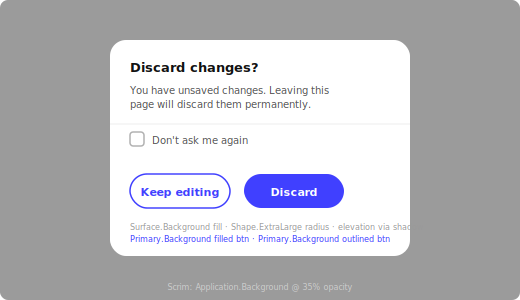

---

### 5.10 List Rows — Density and ColorGroup in Context

List rows use `Application.Background` for the container and `Surface.Container` for hover/selection
highlights. Density adapts via `Spacing` tokens driven by `DeviceIdiom`.

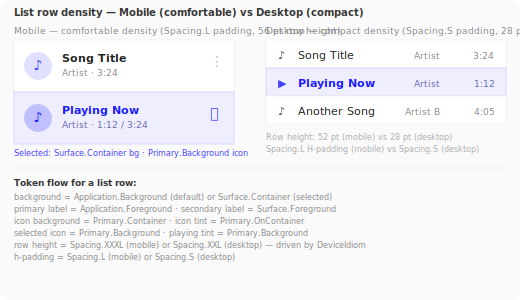

---

### 5.11 Data Visualization Color Series

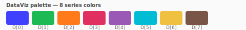

---

### 5.12 Full Component Anatomy


---

## 6. Integration with the DI System

Xui's DI resolves services by walking the view parent chain. `IDesignSystem` follows the same path:

```
View
  └─ GetService<IDesignSystem>() → Parent.GetService<IDesignSystem>()
       └─ RootView → Window.GetService<IDesignSystem>()
            └─ Abstract.Window → Context (app-level DI)
                 └─ IServiceProvider → registered IDesignSystem implementation
```

### 6.1 Registration

```csharp
// In the application host builder:
builder.Services.AddSingleton<IDesignSystem>(new XuiDesignSystem(
    primaryHue: 240f,          // blue
    secondaryHue: 120f,        // green
    roundnessFactor: 1.0f,
    motionPreference: MotionPreference.Curve,
    colorScheme: ColorScheme.Light
));
```

### 6.2 Widget Consumption

```csharp
// In a widget's OnAttach:
protected override void OnAttach()
{
    var ds = GetService<IDesignSystem>()
        ?? throw new InvalidOperationException("IDesignSystem is required.");

    // Read tokens into cached fields for use during Render and Measure:
    _background      = ds.Colors.Surface.Background;
    _foreground      = ds.Colors.Surface.Foreground;
    _cornerRadius    = ds.Shape.Large;
    _padding         = new Frame(ds.Spacing.L, ds.Spacing.S);
    _titleStyle      = ds.Typography.TitleMedium;
    _hitRadius       = ds.Device.MinimumHitTestRadius;
    _enterAnimation  = ds.Motion.EmphasizedDecelerate;
    _btnFill         = ds.Colors.Primary.Background;
    _btnText         = ds.Colors.Primary.Foreground;
    _btnHover        = ds.Colors.Primary.Ramp[0.48f]; // Background lightness (0.40) + hover offset (0.08)

    base.OnAttach();
}

// In Render:
public override void Render(IContext context)
{
    context.SetFill(_background);
    context.BeginPath();
    context.RoundRect(Frame, _cornerRadius);
    context.Fill();
    // ... render content
}
```

### 6.3 Theme Change Propagation

When the system-level color scheme changes (e.g. dark mode toggle), the platform adapter fires a
`IDesignSystem.Changed` event. The root window invalidates the entire view tree, causing every widget
to re-query during the next draw pass — or widgets subscribe to `Changed` and re-read only their
relevant tokens.

```csharp
public interface IDesignSystem
{
    // ... (existing members)

    /// <summary>Raised when any design token has changed (e.g. dark mode toggle, font scale change).</summary>
    event Action? Changed;
}
```

---

## 7. Color Theory Guide

### 7.1 Choosing Seed Colors

Given one primary brand hue `H` (0–360°), the following schemes are derivable:

```
Complementary       → Secondary = H + 180°
Analogous           → Secondary = H + 30°,  Tertiary  = H + 60°
Split-complementary → Secondary = H + 150°, Tertiary  = H + 210°
Triadic             → Secondary = H + 120°, Tertiary  = H + 240°
Tetradic / Square   → Secondary = H + 90°,  Tertiary  = H + 180°, Quaternary = H + 270°
```

### 7.2 From Hue to Full Palette using `Color.Oklch.Ramp`

```
For each seed hue H:
  1. Define a chroma level C (e.g. 0.2–0.35 in OKLCH — typical sRGB-safe range)
  2. Build a Color.Oklch.Ramp from (L=0, C=C, H=H) to (L=1, C=0, H=H)
     This single ramp covers all tonal stops via ramp[lightness]:
       L=0.00 → ramp[0.00f]   (near black)
       L=0.40 → ramp[0.40f]   → ColorGroup.Background (light mode)
       L=0.80 → ramp[0.80f]   → ColorGroup.Background (dark mode)
       L=0.90 → ramp[0.90f]   → ColorGroup.Container  (light mode)
       L=1.00 → ramp[1.00f]   → ColorGroup.Foreground (light mode, near white)
  3. Map named color roles to ramp positions (see ColorGroup above)
```

### 7.3 Accessibility Contrast Check

Before using a foreground/background pair, assert:

```
contrastRatio(fg, bg) ≥ 4.5  for normal text  (WCAG AA)
contrastRatio(fg, bg) ≥ 7.0  for normal text  (WCAG AAA)
contrastRatio(fg, bg) ≥ 3.0  for large text or UI components
```

Where:
```
relativeLuminance(c) = (c.R ≤ 0.04045 ? c.R/12.92 : ((c.R+0.055)/1.055)^2.4 * 0.2126)
                     + (… G … * 0.7152)
                     + (… B … * 0.0722)
contrastRatio(fg, bg) = (L_lighter + 0.05) / (L_darker + 0.05)
```

`IColorSystem` should expose a helper `nfloat ContrastRatio(Color foreground, Color background)`.

---

## 8. Roadmap and Next Steps

| Phase | Deliverable |
|---|---|
| **Phase 1** (this doc) | Design system specification, interfaces, token categories |
| **Phase 2** | Implement `Xui.Core.Design` project with all interfaces and a default `XuiDesignSystem` |
| **Phase 3** | Port existing `Border`, `TextBox`, `Label` to consume `IDesignSystem` tokens |
| **Phase 4** | Build `Button` (Filled / Tonal / Outlined / Text) and `ButtonGroup` widgets |
| **Phase 5** | Navigation primitives: `BottomNavBar`, `NavigationRail`, `NavigationDrawer` |
| **Phase 6** | Data visualization palette integration (chart series colors) |
| **Phase 7** | Platform adapters expose `IDeviceInfo` (scale, pointer model, accessibility scale) |
| **Phase 8** | SVG snapshot tests for each widget in all states using the Software renderer |
| **Phase 9** | Demo app (TestApp) adopts design system; BlankApp shows system customization |

---

## Appendix A: Token Reference Quick-Sheet

```
Color.Oklch (nested struct inside Xui.Core.Canvas.Color)
├── Lightness : nfloat  (0.0 black … 1.0 white)
├── Chroma    : nfloat  (0.0 gray  … ~0.37 max in sRGB)
├── Hue       : nfloat  (0–360 °)
├── implicit Color ↔ Oklch conversions
└── static Between(Oklch from, Oklch to) → Oklch.Ramp
         Oklch.Ramp[nfloat t] → Color     (t ∈ [0,1])

ColorGroup (struct in Xui.Core.Design)
├── Background  : Color  (strong action color — filled button fill)
├── Foreground  : Color  (contrast text on Background — button label)
├── Container   : Color  (light tinted fill — chip / tonal button)
├── OnContainer : Color  (text on Container — chip label)
└── Ramp        : Color.Oklch.Ramp  (full tonal range for hover/press states)

IDesignSystem
├── Colors: IColorSystem
│   ├── Application: ColorGroup   (Background=window bg, Foreground=body text,
│   │                              Container=surface fill, OnContainer=card text)
│   ├── Surface: ColorGroup       (Background=card fill, Foreground=card text,
│   │                              Container=alt surface, OnContainer=secondary text)
│   ├── Outline, OutlineVariant   (neutral borders)
│   ├── Primary:   ColorGroup     (Background=filled btn, Foreground=btn label,
│   │                              Container=tonal btn / chip, OnContainer=chip label)
│   ├── Secondary: ColorGroup     (supporting action, same four-color structure)
│   ├── Accent:    ColorGroup     (tertiary highlight)
│   ├── Error:     ColorGroup     (destructive / error state)
│   ├── FocusRing
│   ├── DataVizPalette (span of 8+)
│   ├── IsDark
│   └── GetTonalRamp(hue, chroma) → Color.Oklch.Ramp
│
├── Typography: ITypographySystem
│   ├── Display, HeadlineLarge/Medium/Small
│   ├── TitleLarge/Medium/Small
│   ├── BodyLarge/Medium/Small
│   ├── LabelLarge/Medium/Small
│   └── DefaultFontFamily
│
├── Spacing: ISpacingSystem
│   └── None(0) XXS(2) XS(4) S(8) M(12) L(16) XL(24) XXL(32) XXXL(48)
│
├── Shape: IShapeSystem
│   ├── RoundnessFactor
│   └── None ExtraSmall Small Medium Large ExtraLarge Full
│
├── Motion: IMotionSystem
│   ├── Preference (Curve | Spring), ReducedMotion
│   ├── EmphasizedDecelerate, EmphasizedAccelerate, Standard, …  (CurveToken)
│   └── SpringBouncy, SpringResponsive, SpringSmooth              (SpringToken)
│
├── Icons: IIconSystem
│   ├── GetIcon(name) → IDrawable?
│   └── GetIcon(name, size) → IDrawable?
│
└── Device: IDeviceInfo
    ├── Idiom (Mobile|Tablet|Desktop|Car|TV|Watch)
    ├── PointerModel (Touch|Stylus|Mouse|Controller|Eye)
    ├── Scale (physical px / logical pt)
    ├── MinimumHitTestRadius
    ├── AccessibilityFontScale
    ├── PrefersReducedMotion
    ├── PrefersHighContrast
    └── ColorScheme (Light | Dark)
```
