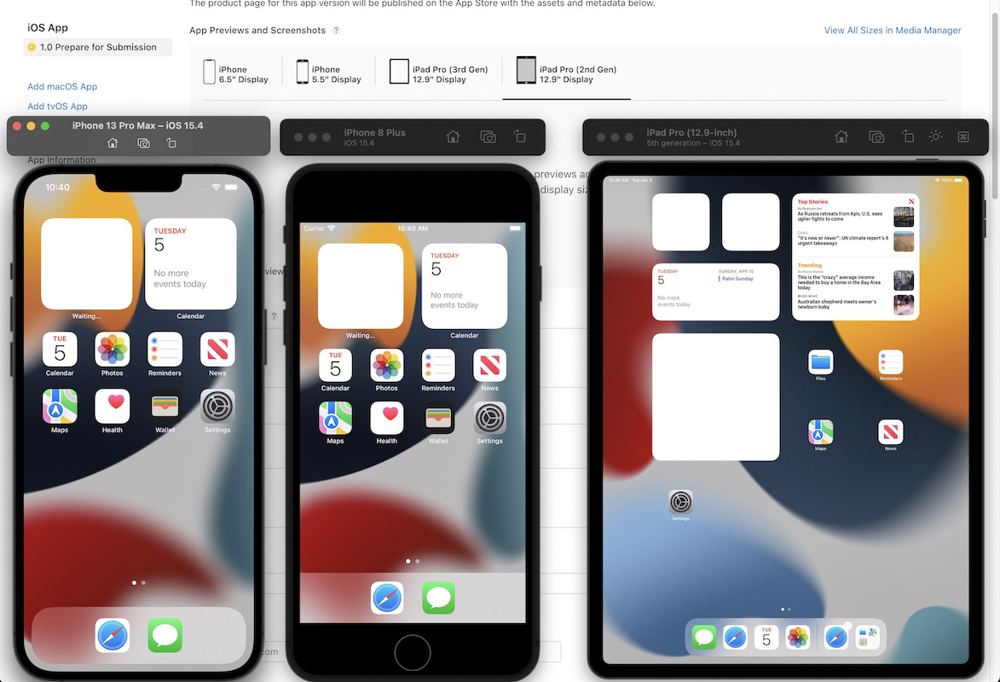
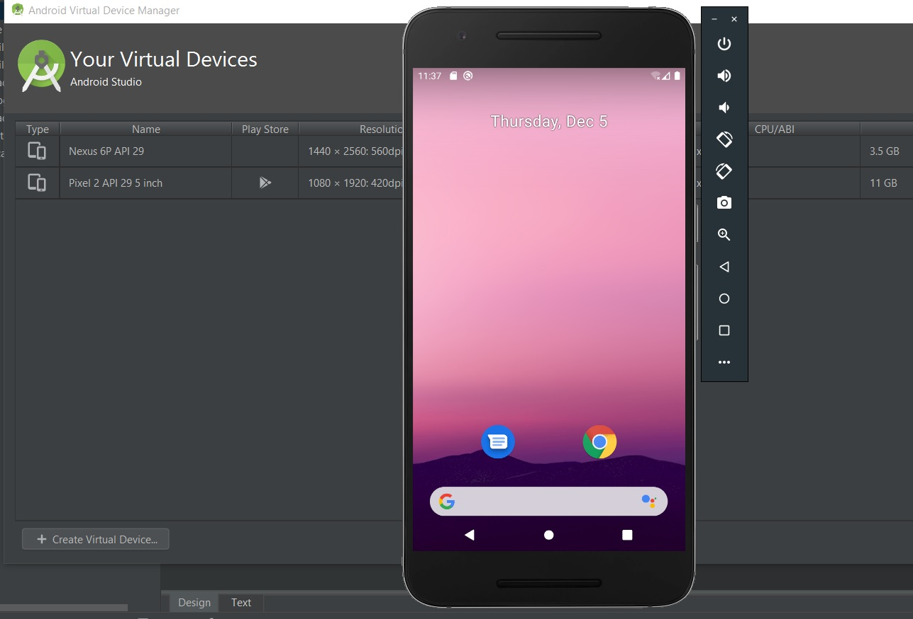
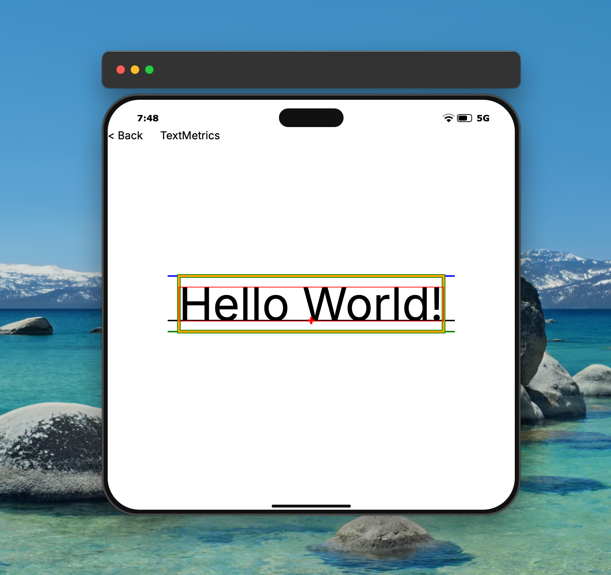
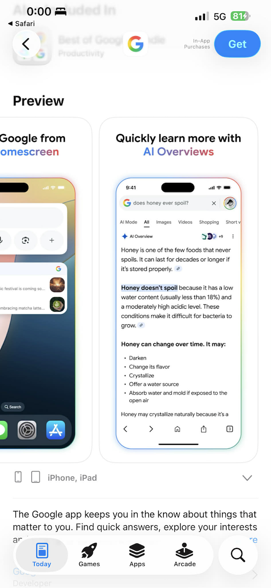

# Design Request — Xui Emulator Frame

## Overview

The Xui Emulator is a desktop middleware window that wraps any Xui mobile/tablet app in a
simulated device frame while the author build, run, and tests the app on macOS or Windows.  It now
renders a black rounded-rectangle frame with a status-bar row (clock, signal, battery, 5G)
and a bottom home-handle pill. This document is an RFQ for a **complete visual and interaction
redesign** of that frame.

---

## Native Simulator/Emulator
### iOS
The native iOS simulator - features the macOS traffic light buttons (top left close, minimize, maximize buttons), custom window header and utility buttons.

### Android
Android uses a skeuomorphic frame, with more conservative utility panel, custom window control buttons.

### Xui
This is the current ***WIP*** version of the Xui emulator.

---

## Aesthetic Direction

**Not skeuomorphic.**
The goal is a **sleek, modern, hardware-inspired frame** with a subtle colorful spirit.

With the move from developers to AI, the consumers for frameworks like this will be less and less tech-savy and show more and more end-user like preferences. Position the emulator in a way it would sell an app, rather than a "developer would sit in a dark room and stare at it for 8 hours". Go through Apple Appstore and Google Play and see how top application position themselves in the marketing screenshots and materials - turn that into emulator.

Use the stores for inspiration of how they convey the feel of a phone:

Colors should work well with the Xui logo (unless we redesign it as well...)

Key visual principles:

- **Phone Body** visually appealing. 
- **"Expand to reveal" controls.**  Hardware input buttons (volume up/down, power,
  mute/ringer) should normally be **invisible or very subtle** protrusions in the dark frame.
  On hover — either of the whole frame or of the button zone — the border should animate
  **outward** (5–8 px expansion, spring physics) to reveal labelled interactive controls.
  This keeps the neutral state clean and the interactive state discoverable.
- **Micro-contrast.**  Screen corners, the display bezels, and the pinhole/notch/island
  cutout should all use finely tuned radius and depth to feel real without being photographic.
- **Responsive sizing.**  The frame should scale gracefully between the phone sizes
  (~330 × 680 dp) and tablet sizes (~768 × 1024 dp) without the gradient ring or hardware
  buttons looking stretched.
- **Not only desktop** The Xui framework also supports browser emulation. Through WebAssembly, can show the emulator in a webpage with compromised performance, but still functional. The Xui framework also natively supports SVG as render targets - for preview of apps, demos, docs etc. The emulator body design should also support switching off the rendering of the utility tools and appear static for embedding as still image, but convey the Xui as a brand.

---

## Dynamic Aspects
The Xui emulator has a table with phisical appearance. Phone or tablet:
 - Notch / Pinchole / Dynamic Island
 - Corner radiuses
The user can switch the emulated device, and these settings will apply to the emulator body.

These affect the software aspect of the application. iPhone's large corner radiuses need the app layout to accommodate, so these are important for preview. And to large extent can convey the sense of the hardware.

Physical properties like hardware buttons, volume, home, back, etc. do not interfere with the application software. The emulator should provide options to interact with the phisical buttons buttons but these do not need to be skeuomorphic. E.g. it would be perfectly fine to put 3 dots at the bottom of the frame that on pointer hover grow up to morph into triangle, circle and square (the 3 Android hardware buttons) without being physically accurate.

---

## Utility "Toolbar"

The 52 px drag-area at the top should evolve into a proper toolbar. It can be completely redesigned. It doens't have to be standard toolbar, but will need to enable the user to trigger:

| Control | Description |
|---|---|
| App icon + name | Identifies the running app (from `Application.Title`) |
| Device name label | Current device model, e.g. "iPhone 15 Pro" |
| Orientation toggle | Portrait ↔ Landscape icon button |
| Device picker | Dropdown / popover (§5) |
| Simulation panel toggle | Show / hide the software input panel (see "Software Input Panel / Overlay") |
| FPS counter | Live frames-per-second badge |
| Hot-reload indicator | Amber dot when hot-reload is active |
| Minimize / Fullscreen | Window management icons (top-right, macOS-style) |

The toolbar should use the same gradient accent as the frame ring but at reduced opacity
so it reads as "UI chrome" rather than "device metal".

---

## Hardware Input Controls

### Physical Buttons (always present on real devices)

These should be rendered as subtle raised areas, or simple dots that morph on hover, or as bumps on the device body frame. On hover they could expand and show click targets / icons and/or tooltips.

| Button | Side | Devices | Simulated action |
|---|---|---|---|
| Power / Side button | Right | All | Lock screen / wake |
| Volume Up | Left | All phones | Raise software volume |
| Volume Down | Left | All phones | Lower software volume |
| Mute / Ringer switch | Left | iPhone (non-SE) | Toggle ringer mode |
| Action button | Left | iPhone 15 Pro | Custom configurable action |

Tablet-specific:
| Button | Side | Devices |
|---|---|---|
| Home button | Bezel | iPad SE, older |
| Power button | Top | iPad Air, iPad Pro (USB-C) |

Most phones move away from hardware buttons, but have UX to still trigger these actions (e.g. swipe to click home). However in emulator these gestures are hard to recreate. E.g. on a phone moving the thumb from the edge of the phone swiping up is easy. On PC or macOS, moving the mouse cursor on near the edge of the emulator, but not exactly on the edge (as that triggers resize operation) to swipe - hard. Having a dedicated "clickables" for these helps.

### Software Input Panel / Overlay
Some functionalities require a bit more involved user input to simulate - GPS, Push notifications, etc. These usually are triggered from the utility tools but open a popup or overlay.

Xui will ship with a design system and input toolkit so no need to design the actual forms or input here. But we need design of how this content will be presented in the emulator.

How interaction with these will happen is somewhat essential. Ideally triggering utility tools could open these as overlay. To have the Xui emulator usable in a browser, it would help to have the layout for these panels as overlay, within the emulator frame e.g. clicking a GPS tool, opens a gps control mini-app in an overlay popup over the app.

#### Push Notifications
- **Sender name** text field
- **Notification title** text field  
- **Notification body** text field
- **App icon** selector (choose from installed test apps)
- **[Send notification]** button → fires a synthetic `UNNotification`-style event into the abstract window

#### Location / Geo Services
- **Latitude / Longitude** numeric inputs (with map preview thumbnail)
- **Accuracy** slider (GPS accuracy in meters: 3 m → 1 000 m)
- **Speed** input (km/h) for motion simulation
- **Heading** input (0–360°)
- **[Set location]** button → updates the simulated `CoreLocation`/`Android Location` service
- **Route playback** — load a GPX file and replay a route at configurable speed

#### Sensors & System State
- **Battery level** slider (0–100%) + **Charging** toggle
- **Network type** selector: `WiFi`, `5G`, `4G LTE`, `3G`, `Offline`
- **Signal strength** slider (0–4 bars)
- **Dark / Light mode** toggle
- **Accessibility font size** slider (xs → accessibility-xl)
- **Locale / language** selector
- **Low power mode** toggle

#### Camera & Media (for camera-dependent apps)
- **Front camera** feed selector: real webcam / still image / video file
- **Rear camera** feed selector: same options
- **Microphone** mute toggle

---

## Device Switcher

The utility buttons should include a **device switcher** that lets the developer:

- Select from the full `DeviceCatalog` (phone or tablet)
- Filter by: `Brand` (Apple / Android), `DeviceType` (Phone / Tablet)
- See a live-preview thumbnail of the selected form factor (small icon)
- Rotate between portrait and landscape
- Common quick-picks accessible via a toolbar button group (e.g. "SE → 15 Pro → iPad Air")

Visual groupings in the picker:

| Group | Variants |
|---|---|
| Small phones | iPhone SE; phones ≤ 375 pt wide |
| Standard phones | iPhone 14/15; Pixel 8 Pro; OnePlus 12 |
| Large phones | Galaxy S24 Ultra; phones ≥ 440 pt wide |
| Tablets | iPad Pro 12.9″; iPad Air; Galaxy Tab S9+; Pixel Tablet |

Notch type should auto-update the rendered status-bar chrome (no notch / pill notch /
Dynamic Island / pinhole).  Corner radius is taken directly from `DeviceProfile.ScreenCornerRadius`.

---

## Copy-Rights

Icons, glyphs, design, the deliverable should include art that can be redistributed by Xui and clients. E.g. a company using Xui to develop and app, exporting an SVG to embed into their docs, including icons for battery, signal strength, clock, the way assets are obtained or generated should provide the copy-rights to facilitate that.