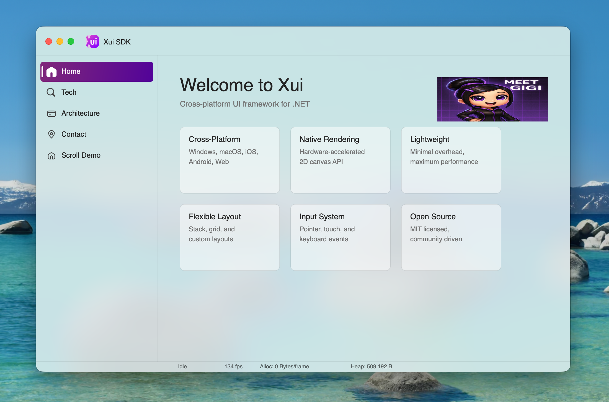

# Design Request — Technology Preview Application

## Overview

The Xui Technology Preview App is a single desktop/mobile application that showcases the
SDK's capabilities across **ten real-world verticals**.  It is not a finished product — it is
an interactive SDK preview that explains the technology, demonstrates its potential, and
invites early-access developers to explore each vertical in depth.

This document is an RFQ for the **visual design** of the app shell, the ten demo modules,
and the transitions between them.

---

## App Purpose & Audience

| | |
|---|---|
| Primary audience | Cross-platform .NET developers/creators evaluating Xui |
| Goal | "I can see myself building *that* with Xui" — within 2 minutes of opening the app |
| Format | Desktop app (macOS / Windows), Mobile via the Xui Emulator, also runnable as a browser WASM demo, AppStore / Google Play |
| Tone | Technical confidence, not marketing gloss. |

---

## Similar Frameworks
 - [Avalonia](https://avaloniaui.net/showcase)
 - [Flutter](https://flutter.dev/showcase)
 - [Uno](https://platform.uno)
 - [Kotlin](https://kotlinlang.org/multiplatform/)

How is Xui different? Xui uses Direct2D and CoreGraphics and other platform SDKs for rendering which makes it blend with the platform (e.g. Subpixel text antialias on Window LCD monitors) while the UI hierarchy is unified (unlike .NET MAUI or Uno which step on native widgets and drive varying behavior on different platforms), that also comes with small app footprint. Probably the toughest competition is Flutter. But Xui also has 1:1 mapping for the rendering with Web Canvas, events, layouts, a lot of primitives are C# version of W3 spec, which also makes it easy to learn, transfer skill, adopt AI flows.

Platforms like this often feature rich UI widgets library in their SDK apps by 3rd party:

 - [Syncfusion](https://www.syncfusion.com/maui-controls#demo)
 - [DevExpress](https://github.com/DevExpress-Examples/maui-demo-app)
 - [ComponentOne](https://developer.mescius.com/componentone/demos)

When Xui grows, the app may need to accommodate widgets section. Widgets will also come with a design system eventually so the shell app will also need to provide theme selection later.

## App Shell Design
This is a simple WIP:

The left hand section is inspired by the Windows store. On mobile these should be displayed as tab-view.

### Home / Selection Screen

The home screen shows a brief overview of the technology (hero-banner) **tiles** arranged in a grid/list (responsive).

Each app tile:

- Vertical name (bold, white, bottom-left)
- One-line description (light, semi-transparent)
- "Explore" label
- On hover: tile expands slightly (scale 1.02), gradient border appears, description fully visible

The home screen itself has a dark background with the rainbow gradient accent language
from the emulator and website design (see `01-emulator.md` and `02-website.md`).

### App Header / Nav Chrome

- Full-width translucent header with a gradient underline
- Back button fades in when inside a demo, hidden on home
- Subtle version badge: "Technology Preview · v0.1"

### Navigation Transitions

Moving from home - demo:
- Selected tile expands to fill the screen (hero transition, 400 ms ease-out-expo)
- Demo content fades in from the tile's origin

Moving from demo - home:
- Reverse: content fades, tile collapses back, home grid reassembles

---

## Demo Modules

### Desktop CAD

**What it shows:** Pan, zoom, high-DPI canvas rendering, custom input handling.

Screen layout:
- Left panel: tool palette (pen, select, zoom, pan, measurement)
- Central canvas: a technical drawing (floor plan or mechanical part) rendered with
  `IContext.BeginPath` / `Stroke` / `Fill`
- Right panel: property inspector (selected object dimensions, coordinates)
- Status bar: cursor coordinates, scale, zoom level

Demo interaction:
- Mouse wheel zoom in/out (smooth, 60 fps)
- Pan with middle mouse or two-finger scroll
- Click on a shape to select + show dimensions
- Animated "typing" of coordinates in the property panel to show real-time updates

Design notes:
- Monochrome technical drawing aesthetic — white lines on `#0d0d17`
- Accent color used only for selection highlight and tool-palette active state
- Grid overlay with dynamic density that adapts to zoom level

---

### Hardware Dashboard

**What it shows:** Animated canvas gauges, data visualisation, 120 fps rendering.

Screen layout:
- Six circular gauge widgets (simulated RPM, temperature, voltage, current, flow rate, pressure)
- Two sparkline charts (time-series)
- One large bar-graph (frequency histogram)
- Alert strip at bottom (simulated threshold alerts)

Demo interaction:
- Values animate continuously (sine-wave-driven simulation)
- Click a gauge to expand it to full-screen detail view
- Threshold sliders to trigger alert state (gauge turns red with pulse animation)

Design notes:
- Dark HUD aesthetic (`#060612`)
- Gauge ring colour ramps
- Font: monospace or near-monospace for numeric values
- Scanline / glow post-process effect on the gauge arcs

---

### 3.3 Mobile Game

**What it shows:** Touch input, sprite rendering, animation, 60/120 fps loop.

Screen layout (shown inside the emulator frame from §01-emulator.md):
- A simple arcade-style canvas game: colourful shapes orbiting a central attractor, tap to
  "collect" them
- Score counter (animated increment)
- Level indicator
- Pause / play button

Demo interaction:
- Tap / click to interact with game objects
- The emulator frame (if present) shows the rainbow gradient ring glowing in sync with the
  score multiplier

Design notes:
- Vibrant, saturated colour palette for game objects (contrast with dark background)
- Particle effects on collection (canvas-rendered, not DOM)
- Game runs at 60 fps minimum, 120 fps on ProMotion displays

---

### 3.5 Health Monitor

**What it shows:** Data visualisation, SVG-based charts, animation, wearable companion UI.

Screen layout:
- Weight trend chart (line chart over 30 days)
- Body composition ring charts (fat %, muscle %, water %)
- Heart rate sparkline
- Sleep quality heatmap grid
- "Sync" button (animated spinner during simulated BLE sync)

Demo interaction:
- Tap a chart to expand + show detailed tooltip
- "New reading" button → animates a new data point arriving on the line chart

Design notes:
- Health-app aesthetic: clean white / light grey surfaces with colour-coded data tracks
- Accessible colour palette: avoid red/green-only differentiation
- Typography: large, readable numbers for the key metrics

---

### 3.6 3D Visualisation — "Spatial Canvas"

**What it shows:** 3D rendering integration, GPU shader pipeline, interactive 3D.

Screen layout:
- A 3D car dashboard (steering wheel, instrument cluster, centre console)
  *or* a 3D building floor-plan with selectable rooms
- Camera orbit controls (drag to rotate, pinch to zoom)
- Panel at right: selected element properties

Demo interaction:
- Drag to orbit the 3D model
- Click a room / component to highlight and show metadata
- Animated "live" data overlaid on 3D surfaces (temperature heatmap on rooms, speed on gauge)

Design notes:
- Dark environment with indirect lighting (ambient occlusion look)
- Data overlays use the canvas 2D API rendered on top of the 3D layer
- The transition from 2D gauges (demo 3.2) to 3D gauges here should feel evolutionary

---

## 4. Four Lifestyle & Vertical-Specific Demo Modules

### 4.1 Coffee Machine

**What it shows:** Bespoke appliance UI, animated progress arcs, touch-optimised controls.

Screen layout (shown inside the emulator frame — phone portrait):
- **Top**: current brew mode selector (Espresso · Lungo · Americano · Cappuccino) as a
  segmented control with icon + label
- **Centre**: large circular **brew progress arc** (empty → fills over the brew duration);
  inside the arc, animated steam wisps rise from a coffee cup illustration
- **Bottom row**: three parameter sliders — Water temperature (°C), Grind strength (1–5),
  Cup size (ml) — each with live numeric readout
- **"Start brew"** CTA button — large, full-width, warm amber accent
- **Status strip**: boiler warm-up indicator, water tank level, bean hopper level

Demo interaction:
- Tap a brew mode → segmented control animates to new selection, arc resets
- Tap "Start brew" → button shrinks to a pulsing progress ring; arc fills over ~8 s (simulated);
  steam animation intensifies; on completion a "Done ☕" state appears with a subtle particle burst
- Drag temperature slider → arc accent colour shifts warm (red) to cool (blue) in real time

Design notes:
- Warm material palette: deep espresso brown (`#1a0e07`), cream (`#f5e6c8`), amber accent (`#d97706`)
- Icons from the Xui icon library (see `05-iconography.md`): `Coffee / Cup`, `Temperature`,
  `Power / On-Off`; use **Soft** radius variant
- All interactive targets ≥ 44 × 44 pt (appliance context = gloved or wet hands)

---

### Retail Loyalty App — "My Rewards"

**What it shows:** QR code generation, list rendering, progress / tier visualisation, dynamic
promo content — a complete consumer loyalty-card experience.

Screen layout (shown inside the emulator frame — phone portrait, two main tabs):

**Tab 1 — My Card:**
- Top half: animated QR code (the code itself animates in with a square-by-square reveal over
  200 ms); below the QR, the member name and current-points balance in large type
- Points progress bar towards next tier (Bronze → Silver → Gold → Platinum) with labelled
  milestones and a glowing gradient fill

**Tab 2 — Promotions:**
- Horizontal promo banner carousel (auto-advances every 4 s, spring bounce on swipe)
- Vertical scrollable list of active promotions, each as a card with:
  - Brand / category icon
  - Offer headline (e.g. "Buy 3 pairs of shoes, get 50% off your 4th")
  - Discount badge (e.g. "50% OFF")
  - Points cost or qualifying threshold
  - Expiry date pill
  - "Redeem" button (disabled until qualifying purchase is detected)

Demo interaction:
- Tap "Redeem" → QR code updates to a single-use redemption code with a countdown timer
- Swipe promo card right → "Saved" checkmark animates; card moves to "Saved offers" section
- Points balance ticks up (simulated) → tier progress bar animates, milestone label pulses
- Reaching a new tier → full-screen confetti particle burst, tier badge morphs with a scale
  spring (0.6 → 1.1 → 1.0)

Design notes:
- Two-tone palette: rich black background with a brand-accent colour switcher in the demo
  toolbar (lets developer try different retailer colour schemes)
- QR code rendered entirely via `IContext.FillRect` calls — demonstrates canvas primitives
  composing into a recognisable graphic
- Tier badges use the circular gauge component from §5 shared components

---

### Vacuum Robot — "Clean Schedule & Monitor"

**What it shows:** Floor-plan canvas, real-time path animation, schedule UI, sensor state.

Screen layout (shown inside the emulator frame — phone portrait, three tabs):

**Tab 1 — Map:**
- Full-bleed canvas floor-plan of a two-room apartment (grey walls, room labels)
- Robot icon positioned and animated along a cleaning path in real time (simulated)
- Cleaned area shaded progressively as the robot passes (alpha-filled rectangles)
- Obstacle indicators (small red dots that appear randomly to simulate dynamic obstacles)
- Mini-legend: battery %, area cleaned (m²), time elapsed

**Tab 2 — Schedule:**
- Weekly grid (Mon–Sun, 24-hour slots) showing scheduled clean sessions as coloured blocks
- Tap an empty slot → popover to set start time, duration, room selection, repeat
- Tap an existing session → edit / delete
- "Next clean" countdown pill at the top of the tab

**Tab 3 — History:**
- List of past cleaning sessions: date, duration, area covered, map thumbnail
- Tap a session → expand to show full cleaned-area map with path replay (scrubable timeline)

Demo interaction:
- Tap "Start clean" → robot begins animated path; battery depletes in simulated time
- Battery reaches 20% → robot returns to dock with a curved path animation; dock icon pulses
- Swipe a history card → delete with a snap animation

Design notes:
- Muted teal/grey palette (`#0a1a1a` background, `#00c8a0` robot accent) — functional, calm
- Floor-plan rendered with `IContext.Stroke` (walls) and `IContext.Fill` (room fills, cleaned shading)
- Robot path uses `IContext.BezierCurveTo` — a direct showcase of the Canvas curve API
- Icons: `Robot / Vacuum`, `Schedule / Clock`, `Map / Floor Plan` from `05-iconography.md`;
  use **Sharp** radius variant (industrial feel)

---

### Museum Tour — "Audio Guide"

**What it shows:** Multilingual UI, audio playback controls, rich content cards, map integration.

Screen layout (shown inside the emulator frame — phone portrait):

**Onboarding screen:**
- Museum logo / name at top
- Language picker: horizontally scrollable list of flag + language-name pills
  (English, Español, Français, Deutsch, 日本語, 中文, العربية, …; 12 languages)
- "Start tour" CTA (disabled until a language is selected)
- Subtle animated background: soft overlapping arcs in gold/cream suggesting architectural detail

**Tour home:**
- Current exhibit card (full-bleed image + title + room number)
- **Audio player bar** (fixed bottom): artwork thumbnail, track title, scrub bar, play/pause,
  previous/next exhibit, speed selector (0.75× / 1× / 1.25× / 1.5×), CC toggle
- Exhibit list: vertically scrollable cards — thumbnail, exhibit name, room, duration pill,
  "Visited" checkmark overlay once played past 80%

**Exhibit detail screen:**
- Full-screen exhibit image with parallax scroll
- Audio player (same bar) transitions upward to centre
- Description text (rendered via `IContext.FillText` with the Xui font engine)
- "Related exhibits" horizontal scroll strip at the bottom

Demo interaction:
- Tap a language → pill animates to selected state (fills with accent); "Start tour" activates
- Tap "Start tour" → hero transition to tour home (see §2.3 transitions)
- Tap play → audio progress bar animates (simulated); exhibit cards highlight as audio reaches them
- Complete 80% of an exhibit → "Visited" checkmark draws in on the card; progress ring on home
  screen increments

Design notes:
- Warm cultural palette: deep midnight blue (`#0d0d20`), gold accent (`#c9a84c`), parchment text (`#f0e8d0`)
- Typography is prominent — this is a reading/listening experience; use the Inter font already
  bundled in `Xui.Core.Fonts`
- Language pill selection demonstrates the icon library's `Language / Globe` icon at **Rounded** variant
- Audio scrub bar rendered as a `LinearGradient` + `RoundRect` — a clean canvas primitive showcase

---

## Shared Component Patterns

These components appear in multiple demo modules and should be designed as a reusable system:

| Component | Used in |
|---|---|
| Circular gauge | Dashboard, Health, 3D |
| Sparkline chart | Dashboard, Health |
| Line chart | Health |
| Floor-plan canvas | Vacuum robot (4.3), CAD, 3D |
| Data card | All |
| Alert strip | Dashboard, IoT |
| Tab bar (bottom, mobile) | All mobile layouts |
| Expanded detail overlay | All |
| Brew progress arc | Coffee machine (4.1) |
| QR code canvas render | Retail loyalty (4.2) |
| Points / tier progress bar | Retail loyalty (4.2) |
| Promo card list | Retail loyalty (4.2) |
| Robot path canvas | Vacuum robot (4.3) |
| Audio player bar | Museum tour (4.4) |
| Language picker pills | Museum tour (4.4) |

---

## Performance Indicator

A persistent but subtle FPS + memory badge in the app chrome (similar to the emulator
toolbar) that stays visible across all demos.  This is a deliberate signal that Xui is fast.

---

## Out of Scope

- Actual data sources / BLE / hardware integration (simulated data only for V1)
- App Store / Play Store submission packaging
- Localisation (English only for V1)
- Data sets will be obtained form mocks or dumps