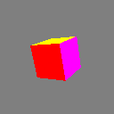

# 3D Rendering

Xui supports hardware-accelerated 3D rendering directly inside your application views. Define meshes, write shaders, and render interactive 3D content — all from C#, running natively on Metal (macOS/iOS) and DirectX (Windows).



Shaders are written as regular C# code. A build-time source generator compiles them to HLSL and MSL automatically, so the same shader runs on every platform without maintaining separate shader files. The software renderer executes the same shaders on the CPU, enabling headless testing on CI machines without GPU hardware.

## How It Works

1. **Write shaders in C#** — define vertex and fragment shaders as structs implementing `IVertexShader<>` and `IFragmentShader<>`.
2. **Compile at build time** — the `[ShaderProgram]` attribute triggers a Roslyn source generator that produces HLSL and MSL shader code as compile-time constants.
3. **Run on GPU** — at runtime, the platform provides an `IGpuDevice` (Metal or D3D11) that compiles and executes the generated shaders on the GPU.
4. **Test on CPU** — the same shaders run on the software renderer for headless testing without GPU hardware.

## Architecture

```
C# Shader (IVertexShader / IFragmentShader)
    ↓ [build time — Roslyn source generator]
IR (Intermediate Representation)
    ↓
HLSL (Windows) + MSL (macOS/iOS)
    ↓ [runtime]
GPU Hardware (D3D11 / Metal)
    or
CPU Software Renderer (for testing)
```

## Shader Types

The GPU pipeline uses its own type system that maps directly to GPU shader types:

| C# Type | HLSL | MSL | Size |
|---------|------|-----|------|
| `F32` | `float` | `float` | 4 bytes |
| `Float2` | `float2` | `float2` | 8 bytes |
| `Float3` | `float3` | `float3` | 12 bytes |
| `Float4` | `float4` | `float4` | 16 bytes |
| `Color4` | `float4` | `float4` | 16 bytes |
| `Float4x4` | `float4x4` | `float4x4` | 64 bytes |

These types support implicit conversion from `float`, `double`, `nfloat`, and from Canvas types like `Color` and `Point`:

```csharp
F32 val = 3.14;              // from double
Color4 c = Colors.Red;       // from uint constant
Color4 c2 = myCanvasColor;   // from Xui.Core.Canvas.Color
Float2 pos = myPoint;        // from Xui.Core.Math2D.Point
```

## Quick Start

See [Writing Shaders](shaders.md) to define your first shader program, or [Rendering a Mesh](mesh-rendering.md) for the full pipeline from vertices to pixels.
