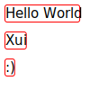

# SvgDrawingContext

This article demonstrates how to use Xui’s `SvgDrawingContext` to draw vector graphics directly into an SVG file, using the same APIs available on native platforms. This backend is ideal for static output, testing, or generating documentation visuals without relying on a GPU or rasterization.

The example below includes:

* A filled rounded rectangle
* A heart-shaped Bézier path with stroke
* A small filled circle

The output is written to an SVG file using `System.IO.Stream`, and the same drawing commands could run on any supported platform (Direct2D, CoreGraphics, Skia) without changes.

## SVG Output


## Example Code

```csharp
using Xui.Core.Canvas;
using Xui.Core.Math2D;
using static Xui.Core.Canvas.Colors;

var size = new Size(240, 120);
using var stream = File.Create("svg-context-demo.svg");
using var context = (IContext)new Xui.Runtime.Software.Actual.SvgDrawingContext(size, stream);

// Filled rounded rect background
context.SetFill(Purple);
context.BeginPath();
context.RoundRect(new Rect(10, 10, 220, 100), 16);
context.Fill(FillRule.NonZero);

// Heart path with stroke
context.SetStroke(DeepPink);
context.LineWidth = 2.5f;
context.BeginPath();
context.MoveTo(new Point(120, 35));
context.CurveTo(new Point(150, 5), new Point(180, 60), new Point(120, 90));
context.CurveTo(new Point(60, 60), new Point(90, 5), new Point(120, 35));
context.ClosePath();
context.Stroke();

// Small filled dot
context.SetFill(Blue);
context.BeginPath();
context.Ellipse(new Point(120, 35), 4, 4, 0, 0, 2 * nfloat.Pi, Winding.ClockWise);
context.Fill(FillRule.NonZero);
```

> 🔪 This is also a great tool for unit tests and documentation—allowing you to validate and visualize rendering output in a headless environment.

## Supported Gradients

`SvgDrawingContext` supports both linear and radial gradients, including nested clipping and styled fills. Below is a more advanced demo rendering the Xui logo shape with gradients, strokes, and geometry clipping:

### SVG Gradient Demo


### Example Code

```csharp
using var context = (IContext)new Xui.Runtime.Software.Actual.SvgDrawingContext((64, 64), stream);

// using the Xui.Core.Canvas.SVG extensions

// Outer clip shape (rounded squircle)
context.PathData().Begin()
    .M((0, 32))
    .C((0, 4.16f), (4.16f, 0), (32, 0))
    .C((59.84f, 0), (64, 4.16f), (64, 32))
    .C((64, 59.84f), (59.84f, 64), (32, 64))
    .C((4.16f, 64), (0, 59.84f), (0, 32))
    .Z();
context.Clip();

// Background gradient fill
context.SetFill(new LinearGradient(
    start: (10, 5),
    end: (54, 59),
    gradient: [
        (0, 0xD642CDFF),
        (1, 0x8A05FFFF),
    ]));
context.PathData().Begin()
    .M((0, 0)).H(64).V(64).H(0).Z(); // Equivalent to context.Rect((0, 0, 64, 64))
context.Fill();

// Left-side triangles
context.SetFill(new LinearGradient(
    start: (0, 20),
    end: (64, 44),
    gradient: [
        (0, 0xE8BEEDFF),
        (1, 0xE4CFE5FF)
    ]));

// Top triangle
context.PathData().Begin()
    .M((5, 0)).L((15, 22)).L((25, 0)).Z();
context.Fill();

// Bottom triangle
context.PathData().Begin()
    .M((5, 64)).L((15, 42)).L((25, 64)).Z();
context.Fill();

// Left triangle
context.PathData().Begin()
    .M((0, 10)).L((10, 32)).L((0, 54)).Z();
context.Fill();

// Stylized "UI" strokes
context.SetStroke(White);
context.LineWidth = 5;

// "U" shape
context.PathData().Begin()
    .M((25, 24)).L((25, 35))
    .Q((25, 45.5f), (32, 45.5f))
    .Q((39, 45.5f), (39, 35)).L((39, 24));
context.Stroke();

// "I" vertical stroke
context.PathData().Begin()
    .M((49, 24)).L((49, 47));
context.Stroke();

// Dot on the "I"
context.SetFill(White);
context.BeginPath();
context.Ellipse((49, 18), 3, 3, 0, 0, π * 2, ClockWise);
context.Fill();
```

## Text + Layout Demo

This example uses full layout and text rendering with custom fonts via the `SvgDrawingContext` and demonstrates dynamic font resolution through a resolver that maps embedded fonts to web URLs.

### SVG Font Layout Demo



### Example Code

```csharp
var size = new Size(400, 400);
using var stream = WriteFile("svg-context-fonts.svg");

using var context = (IContext)new Xui.Runtime.Software.Actual.SvgDrawingContext(
    size,
    stream,
    // List Xui.Core.Fonts embedded fonts
    Xui.Core.Fonts.Inter.URIs,
    // Maps embedded://Xui.Core.Fonts/* fonts to xuiapps.com/fonts/* web urls
    DocsGenerator.XuiDemoFontResolver.Instance);

var root = new VerticalStack()
{
    Content = [
        new Border()
        {
            BorderThickness = 1,
            BorderColor = Red,
            Margin = 5,
            HorizontalAlignment = Left,
            Content = new Label()
            {
                FontFamily = ["Inter"],
                Text = "Hello World"
            }
        },
        new Border()
        {
            BorderThickness = 1,
            BorderColor = Red,
            Margin = 5,
            HorizontalAlignment = Left,
            Content = new Label()
            {
                FontFamily = ["Inter"],
                Text = "Xui"
            }
        },
        new Border()
        {
            BorderThickness = 1,
            BorderColor = Red,
            Margin = 5,
            HorizontalAlignment = Left,
            Content = new Label()
            {
                FontFamily = ["Inter"],
                Text = ":)"
            }
        }
    ]
};

root.Update(new LayoutGuide()
{
    AvailableSize = size,
    Anchor = (0, 0),
    XAlign = LayoutGuide.Align.Start,
    YAlign = LayoutGuide.Align.Start,
    XSize = LayoutGuide.SizeTo.Exact,
    YSize = LayoutGuide.SizeTo.Exact,
    Pass = LayoutGuide.LayoutPass.Measure | LayoutGuide.LayoutPass.Arrange | LayoutGuide.LayoutPass.Render,
    MeasureContext = context,
    RenderContext = context
});
```

## Use Cases

`SvgDrawingContext` is ideal for generating static documentation assets, deterministic rendering in CI environments, or regression testing your UI layout logic. Since it bypasses rasterization and targets vector output, it offers a consistent and lightweight alternative for verifying visual structure across platforms.
